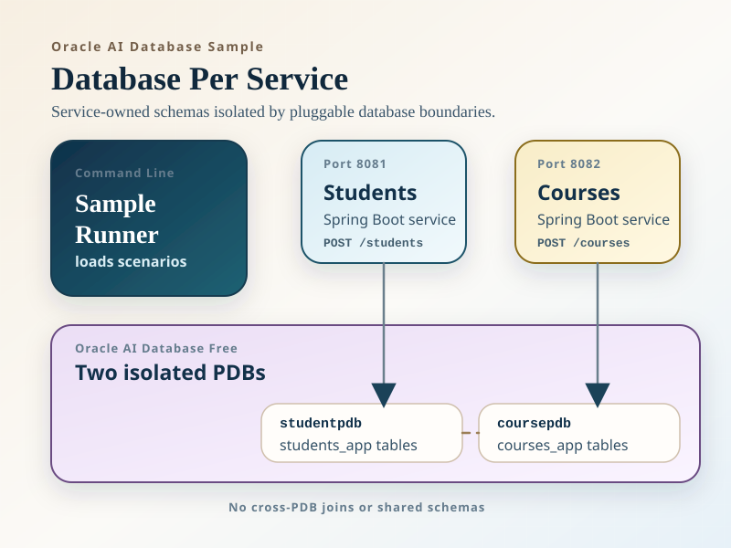
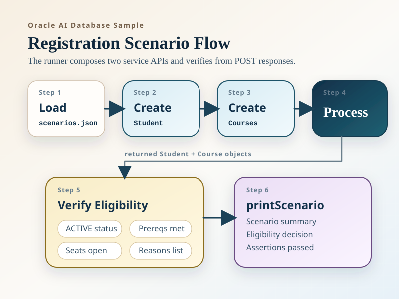
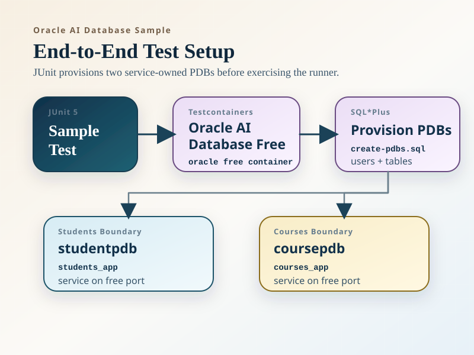

# Database Per Service with Oracle AI Database Pluggable Databases

This sample demonstrates the database-per-service pattern on Oracle AI Database with a simple cross-service workflow: **course registration checks**.

Each service owns its own pluggable database (PDB), schema, tables, and datasource:

- `students/`: student profile and completed-course history in `studentpdb`
- `courses/`: course catalog, prerequisites, and term offerings in `coursepdb`
- `sample/`: command-line runner and end-to-end test that compose data from both services over HTTP

The sample intentionally avoids cross-PDB joins, shared schemas, and database links. The registration check is computed at the application layer after fetching service-owned data from each boundary.

To keep the tutorial compact, each service uses one main JPA entity plus embedded collections. The model is intentionally small:

- `students`: university ID, name, status, and completed course codes
- `courses`: course code, title, prerequisite course codes, and one offering per term

## Diagrams







## Module structure

### `students/`

Owns:

- `students`
- `student_completed_courses`

Exposes:

- `POST /students`
- `POST /students/{studentId}/completed-courses`
- `GET /students/{studentId}`
- `GET /students/{studentId}/completed-courses`
- `GET /db-info`

### `courses/`

Owns:

- `course_catalog`
- `course_prerequisites`
- `course_offerings`

Exposes:

- `POST /courses`
- `POST /courses/{courseCode}/prerequisites`
- `POST /course-offerings`
- `GET /courses/{courseCode}`
- `GET /courses/{courseCode}/prerequisites`
- `GET /course-offerings/{courseCode}?termCode=...`
- `GET /db-info`

### `sample/`

Contains:

- `com.example.sample.DatabasePerServiceSampleRunner`
- the Testcontainers-backed end-to-end test
- the SQL*Plus script that provisions the PDBs and schema objects

## What the sample proves

- Oracle AI Database can isolate service-owned data at the PDB boundary
- two Spring Boot services can use different PDB service names in the same Oracle AI Database instance
- a simple business decision can be composed without violating database ownership

The composed workflow is:

1. Create a student profile in the `students` service
2. Add completed-course history in the `students` service
3. Create catalog and offering data in the `courses` service
4. Read both service-owned datasets
5. Check whether the student is ready to register in the sample runner

The runner keeps the decision small and sample-friendly:

- student status
- prerequisite completion
- available seat in the requested offering

## Run tests

Run the [tests](./src/test/java/com/example/sample/DatabasePerServiceSampleRunnerTest.java) with Maven:

```bash
mvn -pl sample test -am
```

The end-to-end tests provision `studentpdb` and `coursepdb` inside an Oracle AI Database Free container, boot both Spring Boot applications, seed data through the service APIs, and verify ready and not-ready scenarios.

You'll see output similar to the following as the test scenarios run:

```
Scenario: student-is-eligible
    Student: Alice Nguyen (ACTIVE)
    Course: ELIGIBLE-CS404 - Distributed Systems
    Completed courses: ELIGIBLE-CS201, ELIGIBLE-MATH101
    Prerequisites satisfied: true
    Seats available: true
    Eligible: true
    Reasons: Registration checks passed
    Assertions passed
Scenario: student-missing-prereq
    Student: Alice Nguyen (ACTIVE)
    Course: MISSINGPREREQ-CS404 - Distributed Systems
    Completed courses: MISSINGPREREQ-MATH101
    Prerequisites satisfied: false
    Seats available: true
    Eligible: false
    Reasons: Student is missing at least one required prerequisite
    Assertions passed
```


## Local run flow

1. Start an Oracle AI Database Free container.
2. Run the setup script in [`sample/src/test/resources/create-pdbs.sql`](./sample/src/test/resources/create-pdbs.sql) as `sysdba`.
3. Start the `students` service.
4. Start the `courses` service.
5. Run the sample runner.

The setup script creates:

- `studentpdb`
- `coursepdb`
- `students_app`
- `courses_app`
- the `students` service tables
- the `courses` service tables

## Run the services

Start the `students` service:

```bash
mvn -f database-per-service-example/pom.xml -pl students spring-boot:run \
  -DJDBC_URL=jdbc:oracle:thin:@localhost:1521/studentpdb \
  -DUSERNAME=students_app \
  -DPASSWORD=testpwd \
  -DSERVER_PORT=8081
```

Start the `courses` service:

```bash
mvn -f database-per-service-example/pom.xml -pl courses spring-boot:run \
  -DJDBC_URL=jdbc:oracle:thin:@localhost:1521/coursepdb \
  -DUSERNAME=courses_app \
  -DPASSWORD=testpwd \
  -DSERVER_PORT=8082
```

Run the sample runner:

```bash
mvn -f database-per-service-example/pom.xml -pl sample exec:java \
  -DSTUDENTS_BASE_URL=http://localhost:8081 \
  -DCOURSES_BASE_URL=http://localhost:8082
```

The runner seeds a registration scenario, reads both services back, and prints a report showing the decision plus proof that the services are connected to different PDBs.
