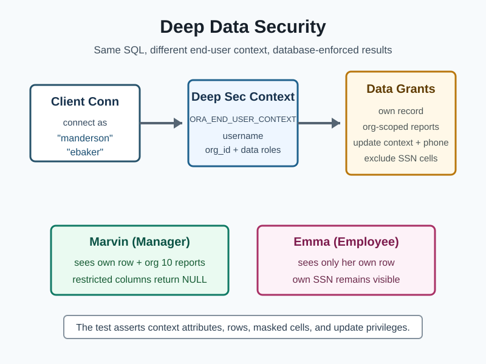

# JDBC Deep Data Security

This module is a small, runnable Deep Data Security sample for Oracle AI Database. It follows the local end-user quick start from the Deep Data Security guide, but drives the validation from a JUnit test over JDBC instead of SQL*Plus.

The workflow is intentionally narrow:

1. Testcontainers starts Oracle AI Database Free.
2. A SYS-owned setup script creates an `hr.employees` table, two local Deep Sec end users, two data roles, two data grants, and mandatory data-grant enforcement on the table.
3. The test connects with JDBC as `"manderson"` and `"ebaker"`.
4. Both users run the same `select * from hr.employees` query.
5. JUnit asserts that data grants filter rows, return unauthorized SSN cells as `NULL`, and expose the expected phone-update authorization through `ORA_CHECK_DATA_PRIVILEGE`.



## What It Proves

Deep Data Security is enforced by Oracle AI Database, not by Java-side filtering. The Java test never adds `where email = ?` or `where manager = ?` predicates. It connects as a Deep Sec end user and lets data grants decide the visible rows and cells.

| End user | Data roles | Expected access |
| --- | --- | --- |
| `"manderson"` | `employee_role`, `manager_role` | Marvin sees his own row with SSN, plus Emma and Taylor as direct reports with SSN returned as `NULL`. |
| `"ebaker"` | `employee_role` | Emma sees only her own row, including her own SSN. |

The employee grant is deliberately small: it lets employees read their own row and grants update authorization only for their own phone number.

```sql
create data grant hr.employees_own_record
    as select, update (phone)
    on hr.employees
    where email = ORA_END_USER_CONTEXT.username
    to employee_role;
```

The test confirms the authorization shape with `ORA_CHECK_DATA_PRIVILEGE`: Marvin's own phone cell is updateable, but Emma and Taylor's phone cells are not updateable through the manager row visibility grant.

The setup also runs `SET USE DATA GRANTS ONLY ON hr.employees ENABLED` so Deep Sec users must go through data grants for the protected table.

## Code Map

- [pom.xml](https://github.com/anders-swanson/oracle-database-code-samples/blob/main/jdbc-deep-data-security/pom.xml) declares the plain JDBC and Testcontainers dependencies.
- [deep-data-security-demo.sql](https://github.com/anders-swanson/oracle-database-code-samples/blob/main/jdbc-deep-data-security/src/test/resources/sql/deep-data-security-demo.sql) creates the HR table, local end users, data roles, and data grants.
- [DeepDataSecurityTest.java](https://github.com/anders-swanson/oracle-database-code-samples/blob/main/jdbc-deep-data-security/src/test/java/com/example/security/DeepDataSecurityTest.java) runs the JDBC proof against Oracle AI Database Free.
- [deep-data-security-flow.svg](https://github.com/anders-swanson/oracle-database-code-samples/blob/main/jdbc-deep-data-security/deep-data-security-flow.svg) diagrams the end-to-end test flow.

## Run The Test

From the repository root:

```bash
mvn -pl jdbc-deep-data-security test
```

The test uses the `gvenzl/oracle-free:23.26.2-full-faststart` image. Docker must be running before Maven starts the test.

## Why Local End Users

Deep Data Security also supports application-mediated security contexts with IAM tokens, application identities, and driver-supplied `EndUserSecurityContext` payloads. That path is closer to a production web application, but it needs IAM, token, and TLS setup.

This sample uses local Deep Sec end users because the official guide describes it as the simplest development and testing scenario. It still exercises real Deep Data Security objects: local end users, data roles, `ORA_END_USER_CONTEXT.username`, and data grants.

## Source Material

- [What Is Oracle Deep Data Security](https://docs.oracle.com/en/database/oracle/oracle-database/26/ddscg/what-is-oracle-deep-data-security.html)
- [Configure Oracle Deep Data Security for Direct Logon with Local End Users](https://docs.oracle.com/en/database/oracle/oracle-database/26/ddscg/configure-oracle-deep-data-security-direct-logon-local-end-users.html)
- [Configure Data Access Control](https://docs.oracle.com/en/database/oracle/oracle-database/26/ddscg/configure-data-access-control-l.html)
- [Validate Data Access Control](https://docs.oracle.com/en/database/oracle/oracle-database/26/ddscg/validate-data-access-control-l.html)
- [About Data Grants](https://docs.oracle.com/en/database/oracle/oracle-database/26/ddscg/data-grants.html)
