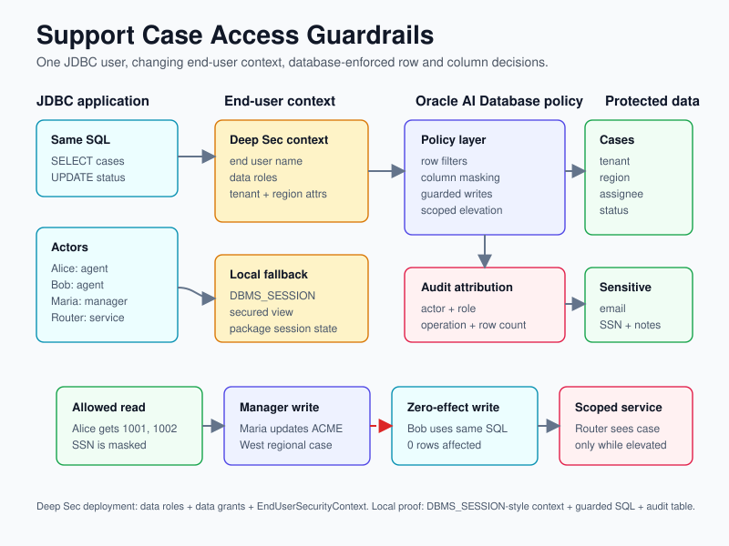
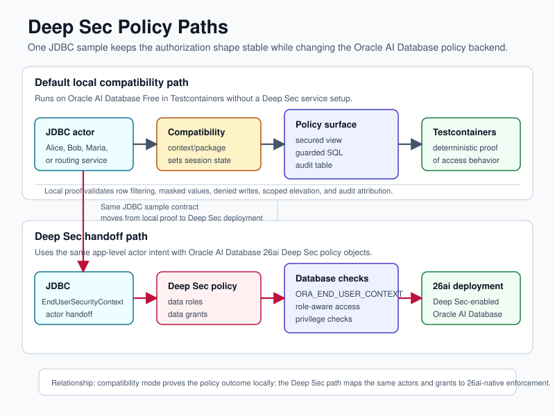

# Testing Oracle AI Database Deep Data Security Without Pretending the Local Path Is the Real One

Security samples are easy to oversell. The useful question is narrower: can I run one Java program, keep the SQL boring, change only the actor context, and prove that the data layer changes what each actor can read or update?

That is what the [`jdbc-deep-data-security`](https://github.com/anders-swanson/oracle-database-code-samples/blob/main/jdbc-deep-data-security/README.md) sample is built to test.

The sample models a multi-tenant support desk. Alice and Bob are support agents. Maria is a regional manager. A routing service is a non-human actor that should see a routed critical case only inside a tightly scoped elevation. The Java code connects as one application user, applies actor context, runs the same repository methods, and records audit rows for each read and write.

The important caveat comes first: the default runnable test uses a compatibility policy path so it can run locally in Oracle AI Database Free with Testcontainers. The module also includes the real JDBC `EndUserSecurityContext` hook and the Deep Data Security data-role/data-grant SQL handoff for Oracle AI Database 26ai environments.



## Why this sample exists

Oracle AI Database Deep Data Security is a database-enforced authorization framework for defining application-level access rules close to the data. The product docs describe it as a way to enforce fine-grained access at row, column, and cell levels, rather than relying only on application code to remember every security check ([Oracle docs: What Is Deep Data Security](https://docs.oracle.com/en/database/oracle/oracle-database/26/ddscg/what-is-oracle-deep-data-security.html)).

That matters more when applications or agents generate SQL dynamically. Oracle's technical brief frames the risk clearly: broad service accounts and application-only controls are fragile when agents can generate queries, and policy needs to account for user identity, role, attributes, and controlled elevation at runtime ([technical brief](https://www.oracle.com/a/ocom/docs/security/deep-data-security-technical-brief.pdf)).

The sample does not try to prove every production property of Deep Data Security. It proves a smaller workflow:

- The same application connection can execute the same repository paths for different actors.
- Actor context changes row visibility, sensitive-column handling, write outcomes, and audit attribution.
- The local compatibility path is deterministic enough for a regular Maven test.
- The Deep Data Security handoff points are visible in code and SQL instead of hidden in prose.

## The proof is a test, not a screenshot

The sample test starts Oracle AI Database Free with Testcontainers and runs the compatibility policy path:

```java
@Container
static final OracleContainer oracleContainer = new OracleContainer("gvenzl/oracle-free:23.26.2-full-faststart")
        .withStartupTimeout(Duration.ofMinutes(5))
        .withUsername("testuser")
        .withPassword("testpwd");
```

Source: [`DeepDataSecurityTest.java`](https://github.com/anders-swanson/oracle-database-code-samples/blob/main/jdbc-deep-data-security/src/test/java/com/example/security/DeepDataSecurityTest.java)

The test then calls the sample in compatibility mode:

```java
AccessReport report = sample.run(SecurityMode.COMPAT);
```

That is intentionally not the same as claiming the local test is exercising Deep Data Security itself. The sample keeps the automated path in compatibility mode because a real Deep Data Security environment needs Oracle AI Database 26ai, policy administration privileges, identity setup, and token-based end-user context propagation.

The test still gives useful evidence. It asserts the authorization behavior that the Deep Data Security path is meant to express:

```java
assertThat(report.aliceCases()).extracting(SupportCaseView::caseId).containsExactly(1001L, 1002L);
assertThat(report.aliceCases()).allSatisfy(supportCase -> {
    assertThat(supportCase.customerEmail()).startsWith("masked-");
    assertThat(supportCase.ssn()).startsWith("***-**-");
    assertThat(supportCase.internalNotes()).isEqualTo("[redacted by policy]");
});

assertThat(report.bobCases()).extracting(SupportCaseView::caseId).containsExactly(1003L);
assertThat(report.mariaCases()).extracting(SupportCaseView::caseId).containsExactly(1001L, 1002L, 1005L);
```

It also proves allowed and denied writes by checking row counts, not exceptions:

```java
assertThat(report.aliceAssignedUpdateRows()).isEqualTo(1);
assertThat(report.aliceUpdateRows()).isZero();
assertThat(report.bobUpdateRows()).isZero();
assertThat(report.mariaUpdateRows()).isEqualTo(1);
```

And it verifies the scoped service actor:

```java
assertThat(report.serviceBeforeElevation()).isEmpty();
assertThat(report.serviceDuringElevation()).extracting(SupportCaseView::caseId).containsExactly(1004L);
assertThat(report.serviceAfterElevation()).isEmpty();
```

Source: [`DeepDataSecurityTest.java`](https://github.com/anders-swanson/oracle-database-code-samples/blob/main/jdbc-deep-data-security/src/test/java/com/example/security/DeepDataSecurityTest.java)

The command that was validated for this module is:

```bash
mvn -pl jdbc-deep-data-security test
```

Validation note: this passed after Docker escalation on June 9, 2026.

## The repository code keeps SQL intentionally dull

The repository does not branch into separate "Alice SQL" and "manager SQL" code paths. Reads go through one view:

```java
private static final String SELECT_VISIBLE_CASES_SQL = """
        select case_id,
               tenant_id,
               region,
               assigned_agent,
               severity,
               status,
               subject,
               customer_email,
               ssn,
               internal_notes,
               policy_reason
        from support_case_access_v
        order by case_id
        """;
```

Writes use one guarded update:

```java
private static final String GUARDED_UPDATE_SQL = """
        update support_cases
        set status = ?
        where case_id = ?
          and support_security.can_update_case(tenant_id, region, assigned_agent) = 1
        """;
```

Source: [`SupportCaseRepository.java`](https://github.com/anders-swanson/oracle-database-code-samples/blob/main/jdbc-deep-data-security/src/main/java/com/example/security/SupportCaseRepository.java)

That guarded update is the compatibility implementation, not Deep Data Security syntax. It is still useful because it forces the same application call to succeed or affect zero rows based on the policy context. The test proves Alice can update one assigned case, Alice and Bob cannot update unauthorized cases, and Maria can update one ACME West case.

The repository also writes its own audit table entry after each operation:

```java
insert into support_case_audit (
    actor_name,
    actor_role,
    security_mode,
    operation,
    case_id,
    rows_affected,
    elevated
)
values (?, ?, ?, ?, ?, ?, ?)
```

Source: [`SupportCaseRepository.java`](https://github.com/anders-swanson/oracle-database-code-samples/blob/main/jdbc-deep-data-security/src/main/java/com/example/security/SupportCaseRepository.java)

That audit table is part of the sample proof. It is not a replacement for production audit configuration. The Deep Data Security docs and technical brief describe centralized auditing and end-user or agent attribution as part of the broader model ([technical brief](https://www.oracle.com/a/ocom/docs/security/deep-data-security-technical-brief.pdf)).

## What the compatibility policy does

The compatibility SQL installs a package, a secured view, and optional session context mirroring. It is deliberately conventional so it can run with a normal local sample setup.

The view filters rows by calling the package policy function:

```sql
from support_cases
where support_security.can_view_case(tenant_id, region, assigned_agent, status) = 1
```

It also masks sensitive values for actors that can see a case but cannot see the sensitive columns:

```sql
case
    when support_security.can_view_sensitive(tenant_id, region, assigned_agent) = 1
        then ssn
    else '***-**-' || substr(ssn, -4)
end as ssn,
case
    when support_security.can_view_sensitive(tenant_id, region, assigned_agent) = 1
        then internal_notes
    else '[redacted by policy]'
end as internal_notes
```

Source: [`02-compat-security.sql`](https://github.com/anders-swanson/oracle-database-code-samples/blob/main/jdbc-deep-data-security/src/test/resources/sql/02-compat-security.sql)

The rules are small enough to inspect:

- A service actor sees routed cases only when `elevated = 'true'`.
- A manager sees cases for the actor's tenant and region.
- An agent sees cases assigned to that actor in the actor's tenant.
- Agents can update assigned case status, and managers can update status inside their regional scope.
- Managers and elevated service actors can see sensitive values.
- Agents receive masked email, SSN, and notes.

The Java compatibility applier sets the actor before work runs and clears it when the connection scope closes:

```java
try (CallableStatement statement = connection.prepareCall("{call support_security.set_actor(?, ?, ?, ?, ?)}")) {
    statement.setString(1, actor.username());
    statement.setString(2, actor.tenantId());
    statement.setString(3, actor.region());
    statement.setString(4, actor.role());
    statement.setString(5, Boolean.toString(elevated));
    statement.execute();
}
```

Source: [`CompatibilityContextApplier.java`](https://github.com/anders-swanson/oracle-database-code-samples/blob/main/jdbc-deep-data-security/src/main/java/com/example/security/CompatibilityContextApplier.java)

Again, this is the local proof harness. It demonstrates the shape of end-user-aware authorization decisions without requiring the full Deep Data Security environment.

## Where the real Deep Data Security hook is



For Oracle AI Database 26ai Deep Data Security deployments, the Java handoff is [`OracleEndUserContextApplier.java`](https://github.com/anders-swanson/oracle-database-code-samples/blob/main/jdbc-deep-data-security/src/main/java/com/example/security/OracleEndUserContextApplier.java).

The docs say Java applications can propagate the end-user security context through Oracle JDBC API extension methods or through an SPI provider, and that the API approach sets and clears the payload on `OracleConnection` ([Configure Java Applications](https://docs.oracle.com/en/database/oracle/oracle-database/26/ddscg/configure-java-applications.html)).

The sample uses the direct API shape:

```java
OracleConnection oracleConnection = connection.unwrap(OracleConnection.class);
OracleJsonObject attributes = jsonFactory.createObject();
attributes.put("tenant_id", actor.tenantId());
attributes.put("region", actor.region());
attributes.put("role", actor.role());
attributes.put("elevated", Boolean.toString(elevated));

EndUserSecurityContext context = EndUserSecurityContext
        .createWithName(databaseAccessToken, actor.username())
        .withDataRoles(actor.dataRoles(elevated))
        .withAttributes("support_case", attributes);

oracleConnection.setEndUserSecurityContext(context);
return oracleConnection::clearEndUserSecurityContext;
```

Source: [`OracleEndUserContextApplier.java`](https://github.com/anders-swanson/oracle-database-code-samples/blob/main/jdbc-deep-data-security/src/main/java/com/example/security/OracleEndUserContextApplier.java)

Two details matter for a skeptical reader.

First, this code sends end-user identity, data roles, and attributes. That matches the docs' description of the end-user security context: it carries the active user's identity, enabled data roles, and runtime attributes used for authorization decisions ([End-User Security Context](https://docs.oracle.com/en/database/oracle/oracle-database/26/ddscg/end-user-security-context.html)).

Second, the context is cleared before the connection goes back to the pool. The Java configuration docs explicitly call out clearing the payload to prevent data leakage across pooled connection reuse ([Configure Java Applications](https://docs.oracle.com/en/database/oracle/oracle-database/26/ddscg/configure-java-applications.html)).

## The Deep Data Security SQL handoff is data roles plus data grants

The Deep Data Security SQL script is not used by the default Testcontainers test. It is a deployment handoff for an Oracle AI Database 26ai environment with Deep Data Security enabled.

It first declares the custom context attributes that the Java code sends. Replace `support_app` with the schema that owns the support-case objects:

```sql
create or replace end user context support_app.support_case using json schema '{
    "type": "object",
    "properties": {
        "tenant_id": {
            "type": "string",
            "default": ""
        },
        "region": {
            "type": "string",
            "default": ""
        },
        "role": {
            "type": "string",
            "default": ""
        },
        "elevated": {
            "type": "string",
            "default": "false"
        }
    }
}'
/
```

It defines data roles:

```sql
create data role support_agent_role
/

create data role support_manager_role
/

create data role support_service_role disabled
/
```

Then it maps policy to data grants. The agent grant is intentionally narrow: it is tenant-scoped, omits sensitive columns from reads, and allows only status updates. Deep Data Security returns unauthorized cells as `NULL`; the compatibility harness uses explicit mask strings only to make the local proof easier to read.

```sql
create or replace data grant agent_assigned_cases
    as select (all columns except customer_email, ssn, internal_notes),
    update (status)
    on support_app.support_cases
    where tenant_id = ora_end_user_context.support_app.support_case.tenant_id
      and assigned_agent = ora_end_user_context.username
    to support_agent_role
/
```

The manager grant uses attributes from the end-user security context and allows status updates within that tenant-region boundary:

```sql
create or replace data grant manager_regional_cases
    as select,
    update (status)
    on support_app.support_cases
    where tenant_id = ora_end_user_context.support_app.support_case.tenant_id
      and region = ora_end_user_context.support_app.support_case.region
    to support_manager_role
/
```

The service role is not part of the routing service actor's base context in the sample app. It is included only inside the elevated context scope, and the grant itself is scoped to routed cases:

```sql
create or replace data grant service_routing_cases
    as select
    on support_app.support_cases
    where status = 'ROUTING'
    to support_service_role
/
```

Source: [`deepsec-security.sql`](https://github.com/anders-swanson/oracle-database-code-samples/blob/main/jdbc-deep-data-security/src/test/resources/sql/deepsec-security.sql)

That maps directly to the Deep Data Security docs. Data grants authorize operations on specific rows, columns, or cells, can reference the end-user security context in predicates, and are assigned to end users or data roles ([Fine-Grained Data Authorization](https://docs.oracle.com/en/database/oracle/oracle-database/26/ddscg/fine-grained-data-authorization.html)).

The script also includes the mandatory access control handoff:

```sql
set use data grants only on support_app.support_cases enabled
/
```

The docs describe this setting as a way to make data grants the required source of access and keep enforcement consistent across access paths ([Fine-Grained Data Authorization](https://docs.oracle.com/en/database/oracle/oracle-database/26/ddscg/fine-grained-data-authorization.html)).

## Why the sample separates the two paths

It would be cleaner on paper if one test exercised everything. It would be less useful as a local sample.

A real Deep Data Security run depends on Oracle AI Database 26ai, identity provider setup, database-access tokens, end-user token handling, and policy administration privileges. Those are the right production concerns, but they make for a poor default developer loop.

So the module splits the work:

- `compat-security.sql` gives a local, deterministic policy harness.
- `DeepDataSecurityTest.java` proves the support-case behavior end to end.
- `OracleEndUserContextApplier.java` shows the real JDBC context hook.
- `deepsec-security.sql` shows the data-role and data-grant shape for Deep Data Security.

The sample code enforces that boundary. If Deep Data Security probing succeeds, the local sample still refuses to pretend it has completed the production setup:

```java
if (effectiveMode == SecurityMode.DEEPSEC) {
    throw new IllegalStateException("""
            Deep Data Security probing succeeded, but this local sample keeps the automated workflow in compatibility mode.
            Use src/test/resources/sql/deepsec-security.sql and OracleEndUserContextApplier.java as the Deep Data Security handoff points
            for a 26ai environment with identity tokens and policy administration privileges.
            """);
}
```

Source: [`DeepDataSecurityTest.java`](https://github.com/anders-swanson/oracle-database-code-samples/blob/main/jdbc-deep-data-security/src/test/java/com/example/security/DeepDataSecurityTest.java)

That is the right kind of honesty for a security sample. It gives you something runnable today without blurring the line between a compatibility proof and a Deep Data Security deployment.

## What I would inspect first

Start with the test:

```bash
mvn -pl jdbc-deep-data-security test
```

Then inspect these files in order:

1. [`DeepDataSecurityTest.java`](https://github.com/anders-swanson/oracle-database-code-samples/blob/main/jdbc-deep-data-security/src/test/java/com/example/security/DeepDataSecurityTest.java) for the expected actor outcomes.
2. [`SupportCaseRepository.java`](https://github.com/anders-swanson/oracle-database-code-samples/blob/main/jdbc-deep-data-security/src/main/java/com/example/security/SupportCaseRepository.java) for the shared SELECT, guarded UPDATE, and audit insert.
3. [`02-compat-security.sql`](https://github.com/anders-swanson/oracle-database-code-samples/blob/main/jdbc-deep-data-security/src/test/resources/sql/02-compat-security.sql) for the local policy implementation.
4. [`OracleEndUserContextApplier.java`](https://github.com/anders-swanson/oracle-database-code-samples/blob/main/jdbc-deep-data-security/src/main/java/com/example/security/OracleEndUserContextApplier.java) for the JDBC context handoff.
5. [`deepsec-security.sql`](https://github.com/anders-swanson/oracle-database-code-samples/blob/main/jdbc-deep-data-security/src/test/resources/sql/deepsec-security.sql) for the Deep Data Security data-role and data-grant handoff.

If the sample fails, that gives you a concrete debugging surface: actor context, policy predicate, row count, or audit evidence. If it passes, it does not prove your production identity setup is correct. It proves the sample's intended authorization behavior and shows where to replace the compatibility harness with Oracle AI Database Deep Data Security policy objects.

That is enough for a useful first pass.
