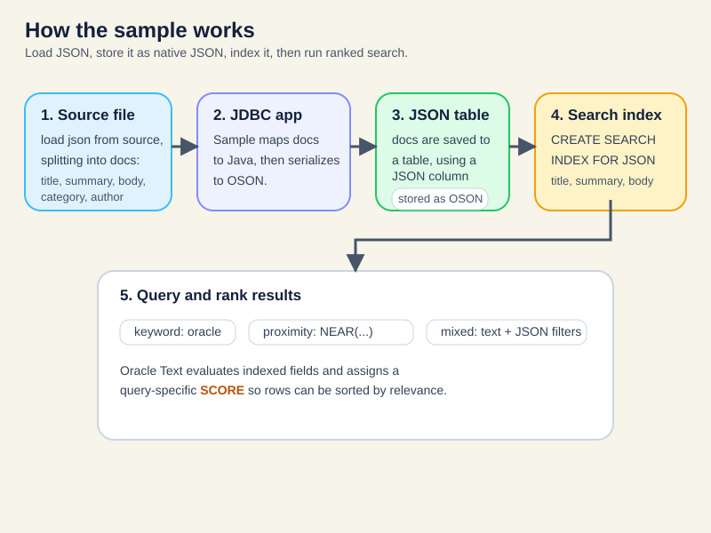

# JDBC JSON Oracle Text

This module demonstrates Oracle Text JSON full-text search over plain JDBC on Oracle AI Database. The sample shows how to:

- load JSON documents from `src/main/resources/documents.json`
- store those documents in a native `JSON` column using OSON/JDBC JSON binding
- create a JSON search index with `CREATE SEARCH INDEX ... FOR JSON`
- run ranked `json_textcontains` queries with `SCORE`
- combine text relevance with structured JSON field filters
- use `NEAR` for proximity search across indexed JSON text fields



## Run the tests

```bash
mvn test
```

The integration test starts Oracle AI Database Free with Testcontainers, grants the sample user Oracle Text privileges, recreates the schema, loads JSON documents from `src/main/resources/documents.json`, and verifies ranked and proximity full-text queries from `JdbcOracleTextSample.main(...)`.

You should see output similar to:

```text
Loaded 4 JSON documents into JSON_DOCUMENTS and committed them.
The Oracle Text JSON search index can now rank matching documents.

Keyword search using json_textcontains(..., "oracle")
Find documents whose indexed JSON text contains the token 'oracle'.
Oracle Text SCORE is a relevance ranking for this query only.
A higher score means a stronger match in this result set. It is not a percentage.
3 document(s) matched. Results are ordered by descending SCORE.
1. Oracle Text for JSON Search | category=GUIDE | author=Ava | score=7 | top-ranked match for this query
2. Storefront Catalog Migration Notes | category=REFERENCE | author=Ben | score=3 | less relevant than the top result for this query
3. Operations Bulletin for Incident Review | category=OPERATIONS | author=Cara | score=3 | less relevant than the top result for this query

Proximity search using json_textcontains(..., "NEAR((json, search), 3)")
Find documents where 'json' and 'search' appear within 3 tokens of each other.
Oracle Text SCORE is a relevance ranking for this query only.
A higher score means a stronger match in this result set. It is not a percentage.
1 document(s) matched. Results are ordered by descending SCORE.
1. Oracle Text for JSON Search | category=GUIDE | author=Ava | score=41 | top-ranked match for this query

Mixed search using json_textcontains(..., "oracle with category = GUIDE and author = Ava")
Find documents whose indexed JSON text contains 'oracle', then keep only JSON documents where category is GUIDE and author is Ava.
Oracle Text SCORE is a relevance ranking for this query only.
A higher score means a stronger match in this result set. It is not a percentage.
1 document(s) matched. Results are ordered by descending SCORE.
1. Oracle Text for JSON Search | category=GUIDE | author=Ava | score=7 | top-ranked match for this query
```

## Run the sample app

From the repository root:

```bash
mvn compile exec:java -Dexec.args="jdbc:oracle:thin:@localhost:1521/freepdb1 testuser testpwd"
```
