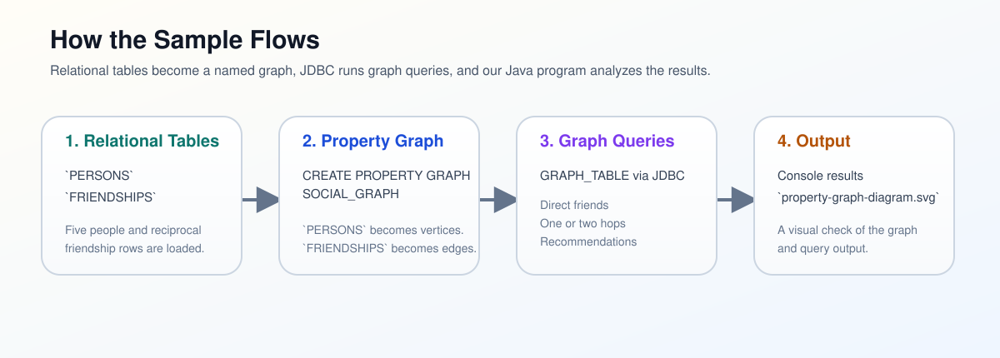
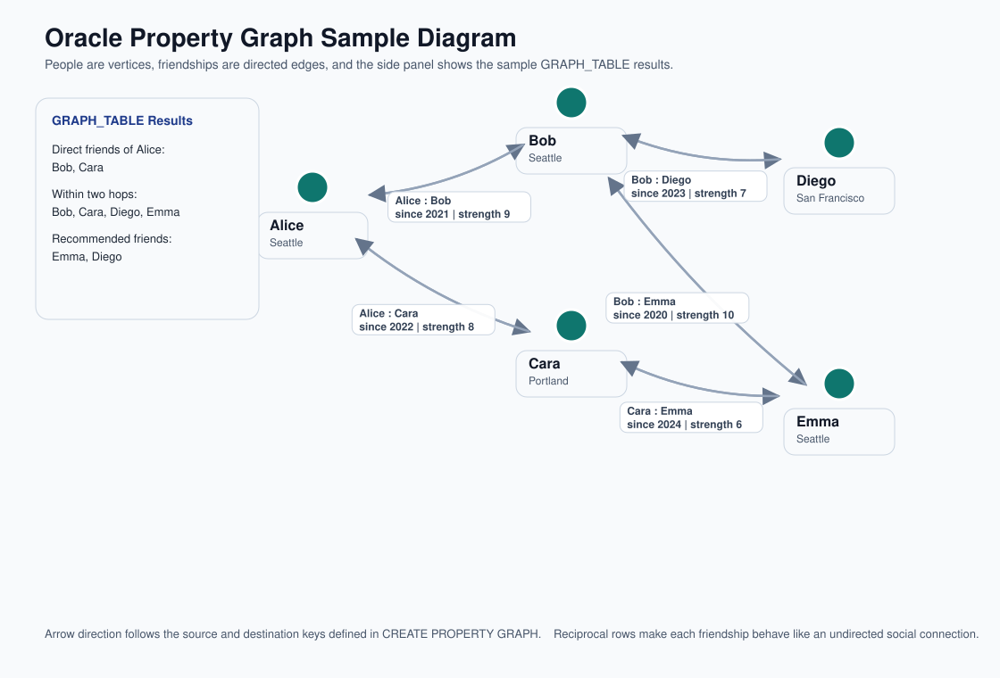

# JDBC Property Graph

This module demonstrates a small Oracle AI Database property graph sample over JDBC:

- `PERSONS` is the vertex table
- `FRIENDSHIPS` is the edge table
- `SOCIAL_GRAPH` is queried with SQL `GRAPH_TABLE`

The sample shows how to:

- create relational tables for a graph-shaped data model
- create a SQL property graph with `CREATE PROPERTY GRAPH`
- query the graph from JDBC with `GRAPH_TABLE`
- express direct-friend, two-hop, and recommendation queries with graph pattern matching
- generate an SVG diagram that shows the people, friendship edges, and query results



The diagram is created solely for the purposes of local visualization. If you are using Graph capabilities in your applications, the use of [Oracle Graph Studio](https://www.oracle.com/database/integrated-graph-database/graph-faq/) is recommended.

## Run the tests

```bash
mvn test
```

The test starts an Oracle AI Database Free container with Testcontainers, grants `CREATE PROPERTY GRAPH` to the sample user, loads the schema, creates the property graph, verifies the graph query results, and checks the generated SVG diagram.

## Run the sample app

Before running against your own database user, make sure that user has the required graph privilege:

```sql
grant create property graph to your_user;
```

Then run the sample with the JDBC connection settings:

```bash
mvn exec:java -Dexec.args="jdbc:oracle:thin:@localhost:1521/freepdb1 testuser testpwd"
```

You should see output similar to:

```text
Direct friends of Alice: [Bob, Cara]
Friends within two hops of Alice: [Bob, Cara, Diego, Emma]
Recommended friends for Alice: [Emma, Diego]
Property graph diagram written to: ./jdbc-property-graph/property-graph-diagram.svg
```

The generated diagram looks like this:



## Documentation

This sample follows the Oracle property graph documentation you linked:

- SQL property graphs: `https://docs.oracle.com/en/database/oracle/property-graph/26.1/spgdg/sql-property-graphs.html`
- PGQL property graphs: `https://docs.oracle.com/en/database/oracle/property-graph/26.1/spgdg/pgql-property-graphs.html`
- Graph Developer's Guide index: `https://docs.oracle.com/en/database/oracle/property-graph/26.1/spgdg/index.html`

