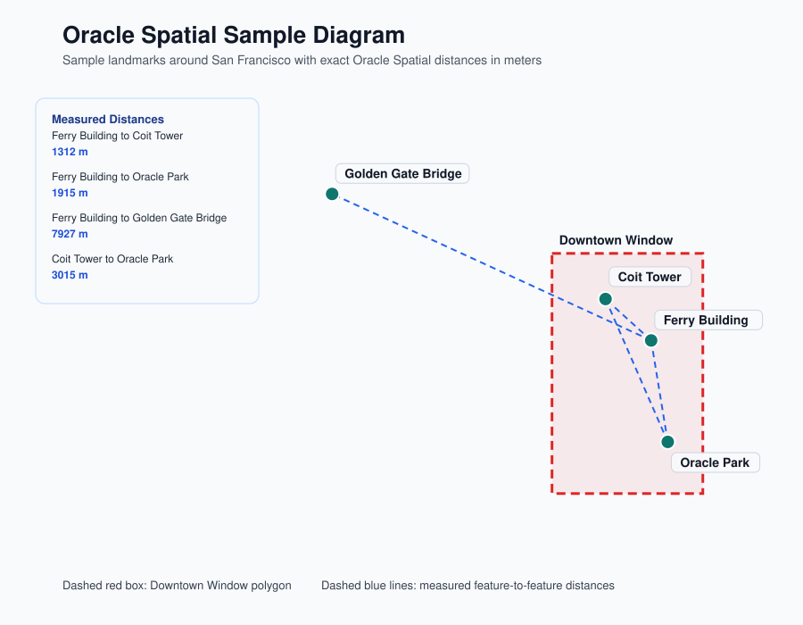

# JDBC Spatial Example

This module demonstrates basic Oracle AI Database Spatial operations over JDBC using `oracle.spatial.geometry.JGeometry`.

The sample shows how to:

- create a table with an `MDSYS.SDO_GEOMETRY` column
- register geometry metadata and build a spatial index
- insert point and polygon geometries with `JGeometry.storeJS`
- read geometries back with `JGeometry.loadJS`
- inspect a geometry's minimum bounding rectangle (MBR)
- run indexed `SDO_FILTER` and `SDO_WITHIN_DISTANCE` queries
- compute exact distances with `SDO_GEOM.SDO_DISTANCE`
- generate an SVG diagram that labels the sample objects and their distances

## Run the tests

```bash
mvn test
```

The test starts an Oracle AI Database Free container, creates the schema, loads sample landmarks around San Francisco, verifies the spatial queries, and checks the generated SVG diagram.

You should see output similar to the following:

```
Landmarks inside Downtown Window: [Coit Tower, Ferry Building, Oracle Park]
Downtown Window MBR: [-122.4200, 37.7700, -122.3800, 37.8100]
Distance from Golden Gate Bridge to Downtown Window: 5238.26 meters
Distance from Ferry Building to Coit Tower: 1312.32 meters
Spatial diagram written to: ./jdbc-spatial-example/spatial-diagram.svg
```

The generated diagram looks like this:



## Run the sample app

Pass the JDBC connection settings as arguments:

```bash
mvn exec:java -Dexec.args="jdbc:oracle:thin:@localhost:1521/freepdb1 testuser testpwd"
```

The sample writes `spatial-diagram.svg` to the `jdbc-spatial-example` module root.
