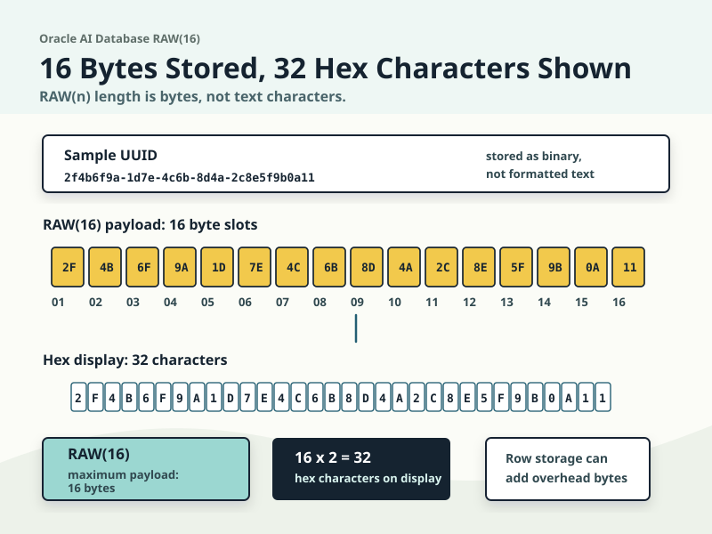
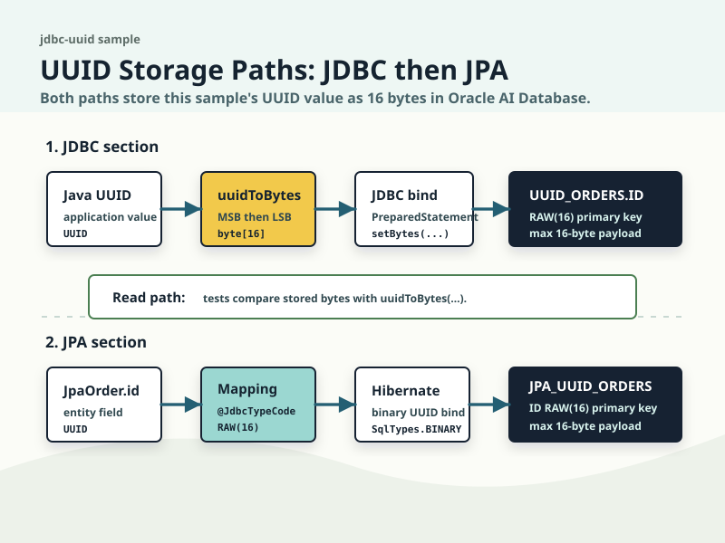
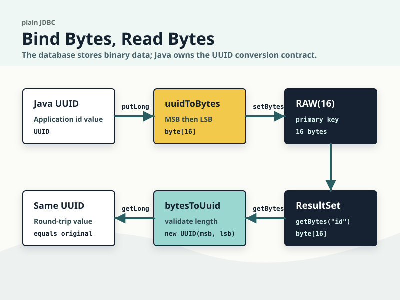
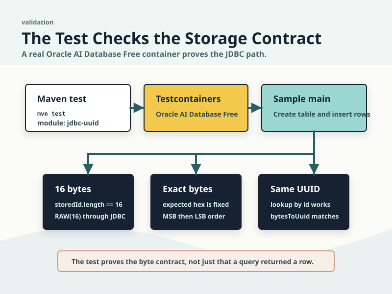

# Java UUID Primary Keys as RAW(16)

You can store UUID primary keys as strings, but then the schema stores text for a value that is really 128 bits.

This sample takes the smaller contract instead: store the Java `UUID` as a `RAW(16)` primary key in Oracle AI Database, then prove the exact byte layout with Testcontainers.

`RAW(16)` allows a maximum payload of 16 bytes, not 16 characters. This sample stores UUID values that are exactly 16 bytes. Oracle's [`RAW(size)` data type](https://docs.oracle.com/en/database/oracle/oracle-database/26/sqlrf/Data-Types.html) defines `size` in bytes, and Oracle's [`SYS_GUID`](https://docs.oracle.com/en/database/oracle/oracle-database/26/sqlrf/SYS_GUID.html) documentation uses the same distinction: a 16-byte `RAW` value is commonly displayed as 32 hexadecimal characters. Row storage can still include normal per-column and row overhead, so this is a payload-size claim, not a full physical row-size claim.



The sample proves four narrow things:

- Java `UUID` values can be stored as `RAW(16)` primary keys without string formatting.
- The JDBC conversion is explicit: most-significant bits first, least-significant bits second.
- Spring Data JPA can keep `UUID` as the repository id type while Oracle AI Database stores the id as `RAW(16)`.
- Testcontainers tests verify the column metadata, stored byte length, byte order, and lookup behavior.

Run the proof from the repository root:

```bash
mvn -pl jdbc-uuid -am test
```

The tests start Oracle AI Database Free with Testcontainers. The JDBC test runs the plain JDBC sample, checks lookup by UUID, and verifies the stored primary key bytes. The JPA test starts a Spring application context, saves entities through a `JpaRepository`, checks that the `ID` column is `RAW` with length `16`, and compares the stored bytes with the Java UUID byte order.



## JDBC

The plain JDBC path is intentionally explicit. [JdbcUuidSample](https://github.com/anders-swanson/oracle-database-code-samples/blob/main/jdbc-uuid/src/main/java/com/example/uuid/JdbcUuidSample.java) creates this table:

```sql
create table uuid_orders (
    id raw(16) primary key,
    order_number varchar2(40) not null unique,
    customer_name varchar2(100) not null,
    total_amount number(10,2) not null
)
```

The conversion function writes the most-significant 64 bits first, then the least-significant 64 bits:

```java
public static byte[] uuidToBytes(UUID uuid) {
    return ByteBuffer.allocate(16)
            .putLong(uuid.getMostSignificantBits())
            .putLong(uuid.getLeastSignificantBits())
            .array();
}

public static UUID bytesToUuid(byte[] bytes) {
    if (bytes.length != 16) {
        throw new IllegalArgumentException("Expected 16 bytes for a UUID but found " + bytes.length);
    }
    ByteBuffer buffer = ByteBuffer.wrap(bytes);
    return new UUID(buffer.getLong(), buffer.getLong());
}
```

That byte order is not hidden in the driver or the database. The application owns it. The insert path binds the 16-byte value with `PreparedStatement#setBytes(...)`; the read path calls `ResultSet#getBytes("id")` and reconstructs the `UUID`.



Run the JDBC sample against a local Oracle AI Database instance:

```bash
mvn -pl jdbc-uuid compile exec:java -Dexec.args="jdbc:oracle:thin:@localhost:1521/freepdb1 testuser testpwd"
```

You should see output similar to:

```text
Stored Java UUID primary keys as RAW(16):
2f4b6f9a-1d7e-4c6b-8d4a-2c8e5f9b0a11 | bytes=2F4B6F9A1D7E4C6B8D4A2C8E5F9B0A11 | order=ORD-1001 | customer=Avery Stone | total=42.50
6c2f4a91-b03d-469d-ae13-0c0d73513a4e | bytes=6C2F4A91B03D469DAE130C0D73513A4E | order=ORD-1002 | customer=Mina Rao | total=125.00
```

The 32-character `bytes=` value is hexadecimal display. It is still the 16-byte payload stored in `RAW(16)`.

The focused JDBC test is [JdbcUuidSampleTest](https://github.com/anders-swanson/oracle-database-code-samples/blob/main/jdbc-uuid/src/test/java/com/example/uuid/JdbcUuidSampleTest.java). It does three useful checks:

- lookup by the original `UUID` succeeds
- a missing `UUID` does not accidentally match another row
- the stored `id` column is exactly 16 bytes and equals `uuidToBytes(ORDER_ONE_ID)`



## JPA

The JPA path keeps the same database shape and lets Hibernate handle the binary binding. [JpaOrder](https://github.com/anders-swanson/oracle-database-code-samples/blob/main/jdbc-uuid/src/main/java/com/example/uuid/jpa/JpaOrder.java) maps a `UUID` id to an explicit `RAW(16)` column:

```java
@Id
@JdbcTypeCode(SqlTypes.BINARY)
@Column(name = "ID", columnDefinition = "RAW(16)", nullable = false, updatable = false)
private UUID id;
```

`columnDefinition = "RAW(16)"` keeps the schema honest. `@JdbcTypeCode(SqlTypes.BINARY)` tells Hibernate to bind the UUID as binary data instead of a formatted string. From there, [JpaOrderRepository](https://github.com/anders-swanson/oracle-database-code-samples/blob/main/jdbc-uuid/src/main/java/com/example/uuid/jpa/JpaOrderRepository.java) can stay ordinary Spring Data:

```java
public interface JpaOrderRepository extends JpaRepository<JpaOrder, UUID> {
    List<JpaOrder> findAllByOrderByOrderNumber();
}
```

The service in [JpaUuidSample](https://github.com/anders-swanson/oracle-database-code-samples/blob/main/jdbc-uuid/src/main/java/com/example/uuid/jpa/JpaUuidSample.java) saves the same UUID values used by the JDBC sample, then flushes the repository so the test can inspect the stored bytes.

Run the Spring Data JPA sample against the same local database:

```bash
JDBC_URL=jdbc:oracle:thin:@localhost:1521/freepdb1 DB_USERNAME=testuser DB_PASSWORD=testpwd \
  mvn -pl jdbc-uuid spring-boot:run -Dspring-boot.run.main-class=com.example.uuid.jpa.JpaUuidApplication
```

You should see output similar to:

```text
Stored JPA UUID primary keys as RAW(16):
2f4b6f9a-1d7e-4c6b-8d4a-2c8e5f9b0a11 | bytes=2F4B6F9A1D7E4C6B8D4A2C8E5F9B0A11 | order=ORD-JPA-1001 | customer=Avery Stone | total=42.50
6c2f4a91-b03d-469d-ae13-0c0d73513a4e | bytes=6C2F4A91B03D469DAE130C0D73513A4E | order=ORD-JPA-1002 | customer=Mina Rao | total=125.00
```

The JPA test is [JpaUuidSampleTest](https://github.com/anders-swanson/oracle-database-code-samples/blob/main/jdbc-uuid/src/test/java/com/example/uuid/jpa/JpaUuidSampleTest.java). It verifies the repository can find by `UUID`, then queries `USER_TAB_COLUMNS` to prove the generated column is `RAW` with `DATA_LENGTH = 16`. It also reads `JPA_UUID_ORDERS.ID` directly and compares those bytes with the same `uuidToBytes(...)` helper used by the JDBC sample.

That last check matters. If the ORM mapping changes later, the test fails on the storage contract, not just on a repository call returning a Java object.

## What to reuse

Use the JDBC pattern when you want the conversion contract to be completely visible in application code.

Use the JPA pattern when the rest of the application already works through Spring Data repositories, but keep the `RAW(16)` column definition and binary UUID binding explicit.

In both cases, keep the byte-order test. The database column only promises binary storage. Your application decides which 16 bytes represent a given Java `UUID`.
