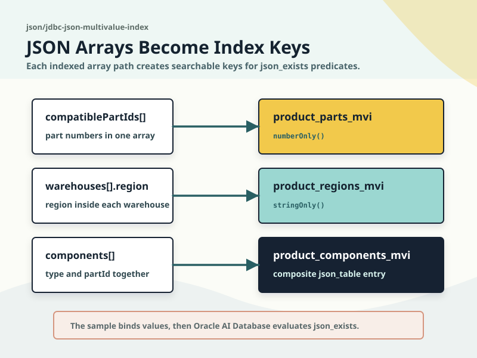
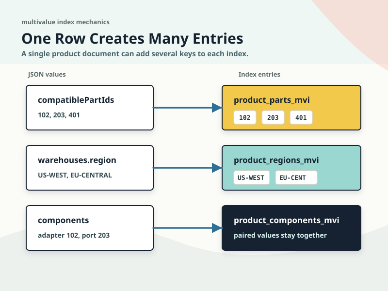
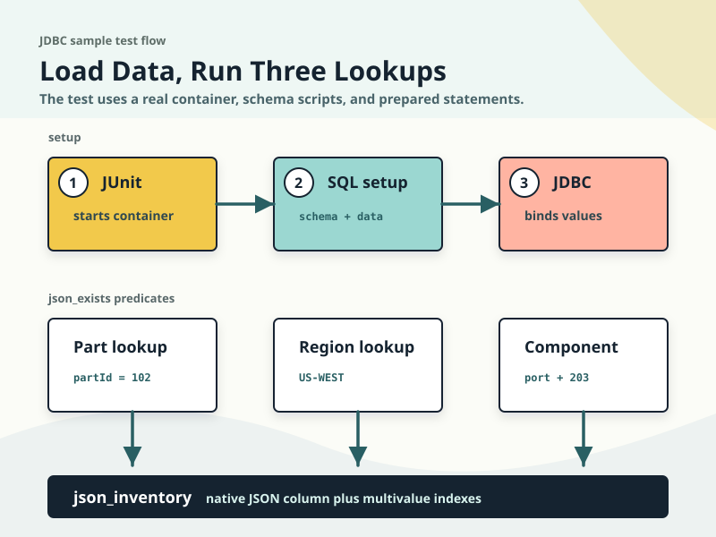

# JDBC JSON Multivalue Index Sample

This sample demonstrates how to use multivalue function-based indexes for JSON array lookups in Oracle AI Database. It stores product documents in a native `JSON` column, creates multiple targeted indexes over array-backed paths, and queries each path with a matching `json_exists` predicate.



## Diagrams

| Diagram | What it shows |
|---------|---------------|
| [Multivalue index overview](./multivalue-index-overview.svg) | How array-backed JSON paths map to the three multivalue indexes used by the sample. |
| [JSON array index entries](./json-array-index-entries.svg) | How one product document contributes multiple numeric, string, and composite index entries. |
| [JDBC json_exists flow](./jdbc-json-exists-flow.svg) | How the Testcontainers test loads the schema and runs JDBC lookups with bind variables. |





## Highlights
- Store inventory products as JSON documents in a native Oracle AI Database `JSON` column.
- Create a numeric multivalue index over scalar values inside the `compatiblePartIds` array.
- Create a string multivalue index over `region` values inside an array of warehouse objects.
- Create a composite multivalue index over `type` and `partId` values inside the same component object array.
- Query each indexed path with `json_exists` and bind variables.
- Print the result set for each indexed lookup from a Testcontainers-powered integration test.

## Index examples

| Index | JSON shape | What it demonstrates |
|-------|------------|----------------------|
| `product_parts_mvi` | `"compatiblePartIds": [102, 203, 401]` | One JSON array field contributes multiple numeric index entries per row. |
| `product_regions_mvi` | `"warehouses": [{ "region": "US-WEST" }]` | A scalar field inside each object of an array can also be indexed as multiple values. |
| `product_components_mvi` | `"components": [{ "type": "port", "partId": 203 }]` | `json_table` can define a composite multivalue index over related fields from the same array element. |

## Prerequisites
- Java 21+
- Maven 3.9+
- Docker Desktop or another OCI-compatible container runtime (required for the Testcontainers test)

## Run the sample

This sample expects the database to be initialized with `schema.sql` and `data.sql`. The simplest way to run it is through the Testcontainers integration test:

```bash
mvn -pl json/jdbc-json-multivalue-index -am test
```

The test starts Oracle AI Database Free, applies both SQL scripts, and calls `MultivalueJsonIndexSample.main` to print the indexed lookup results.

## Run the tests

```bash
docker pull gvenzl/oracle-free:23.26.2-slim-faststart
mvn -pl json/jdbc-json-multivalue-index -am test
```

`MultivalueJsonIndexSampleTest` provisions Oracle AI Database Free in a container, initializes it with `schema.sql` and `data.sql`, and runs `MultivalueJsonIndexSample.main`.

## Learn more
- [Creating Multivalue Function-Based Indexes for JSON_EXISTS](https://docs.oracle.com/en/database/oracle/oracle-database/26/adjsn/creating-multivalue-function-based-indexes-json_exists.html)
- [Overview of Indexing JSON Data](https://docs.oracle.com/en/database/oracle/oracle-database/26/adjsn/overview-indexing-json-data.html)
