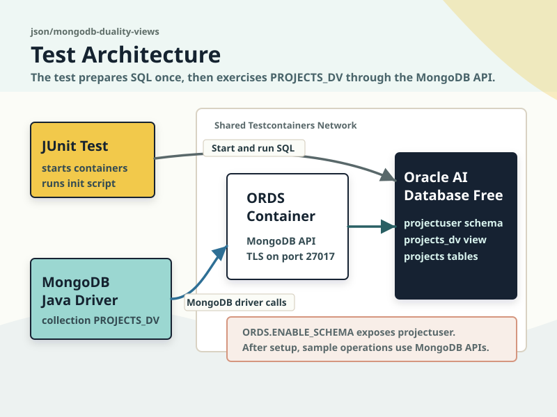
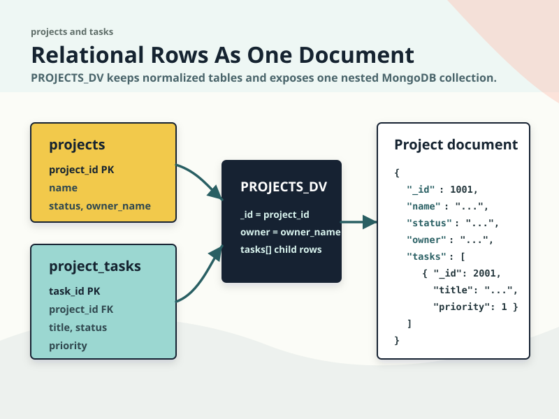
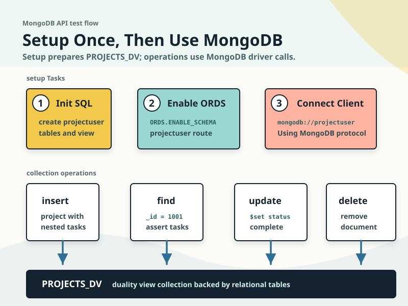

# MongoDB API with JSON Relational Duality Views

This sample demonstrates using the MongoDB Java driver with Oracle AI Database JSON Relational Duality Views exposed through Oracle REST Data Services (ORDS). The test creates a small relational project-tracking schema, exposes it as the `PROJECTS_DV` duality view, and then performs document operations against that view through the MongoDB API.



## What you will learn

- Start Oracle AI Database Free and ORDS together with Testcontainers.
- Create relational tables and a JSON Relational Duality View before ORDS starts.
- Connect with the MongoDB Java driver using the ORDS MongoDB API port.
- Insert, query, update, and delete duality-view documents through the MongoDB API.

## Diagrams

| Diagram | What it shows |
|---------|---------------|
| [Test architecture](./mongodb-duality-architecture.svg) | JUnit, ORDS, Oracle AI Database Free, and the MongoDB Java driver running together in the test. |
| [Duality view mapping](./duality-view-mapping.svg) | How `projects` and `project_tasks` become the nested `PROJECTS_DV` document collection. |
| [MongoDB CRUD flow](./mongodb-crud-flow.svg) | The setup sequence and the `insertOne`, `find`, `updateOne`, and `deleteOne` operations. |





## Run the test

Pull the Oracle AI Database Free image ahead of time to prevent timeouts:

```bash
docker pull gvenzl/oracle-free:23.26.1-slim-faststart
```

Then run the module test from the repository root:

```bash
mvn -pl json/mongodb-duality-views -am test
```

`MongoDbDualityViewsTest` starts Oracle AI Database Free, runs `mongodb_duality_init.sql`, enables the `projectuser` schema in ORDS, and uses the MongoDB Java driver to work with documents in the `PROJECTS_DV` collection.

## Related resources

- [ORDS Testcontainers](../../ords-testcontainers/README.md)
- [JSON Relational Duality Views overview](https://docs.oracle.com/en/database/oracle/oracle-database/26/jsnvu/overview-json-relational-duality-views.html)
- [Oracle AI Database API for MongoDB](https://docs.oracle.com/en/database/oracle/mongodb-api/)
