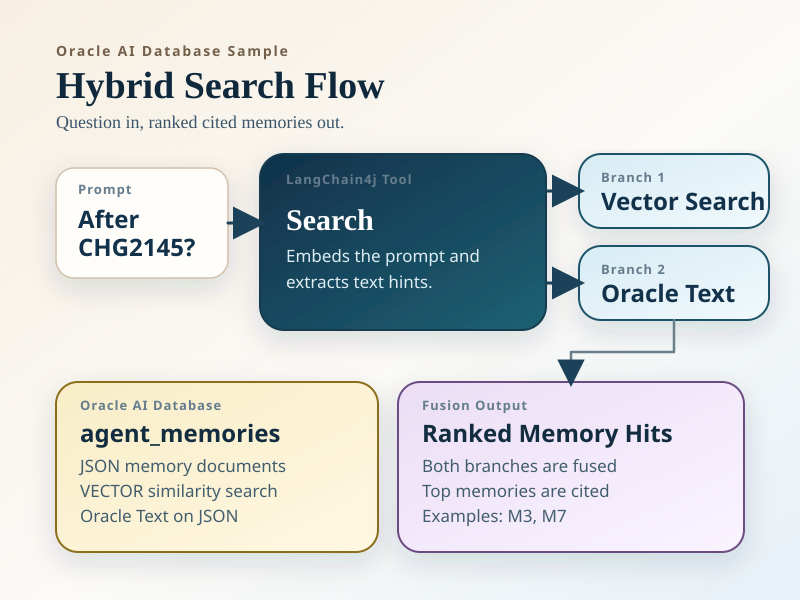
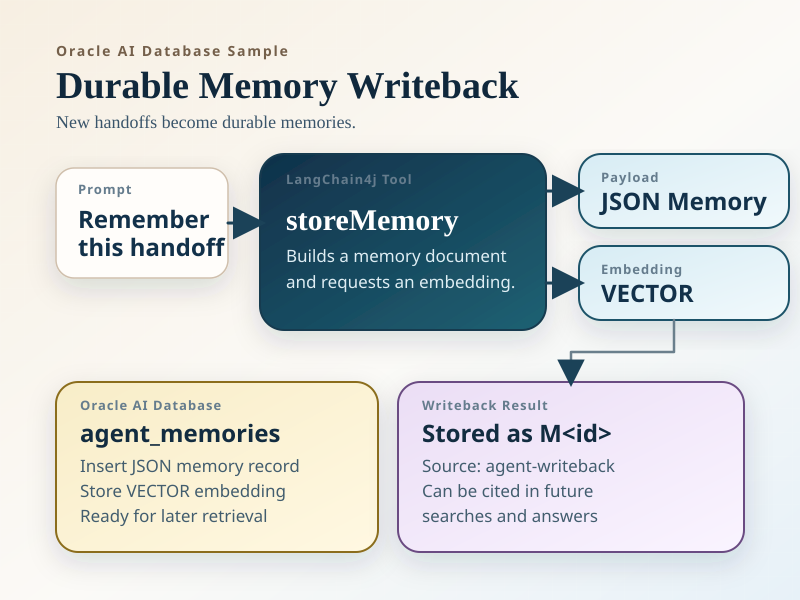

# LangChain4j Agent Memory

This module demonstrates how Oracle AI Database can serve as both **durable agent memory** and an **append-only conversation transcript store** for a LangChain4j assistant. The sample combines:

- LangChain4j tools and chat orchestration with `gpt-5-nano`
- `text-embedding-3-small` embeddings stored in an Oracle AI Database `VECTOR` column
- Oracle Text over a native `JSON` memory document with `json_textcontains`
- hybrid memory retrieval that fuses semantic similarity with exact text relevance
- writeback of new handoff notes so the agent can remember important outcomes
- append-only conversation transcript logging for each chat session

The sample scenario is an ops handoff assistant for a fictional commerce platform. Seeded memories include runbooks, incident reviews, decisions, and shift handoffs. Vector search helps when the operator paraphrases an incident, while Oracle Text helps recover exact change tickets and incident IDs such as `CHG2145` and `INC4721`.

At runtime the app initializes two tables if they do not already exist:

- `agent_memories` stores durable JSON memory documents plus their embeddings
- `agent_conversation_log` stores a transcript of system, user, assistant, and tool messages, organized by conversation ID


Additional diagrams:






## Run the tests

```bash
export OPENAI_API_KEY=<your key>
mvn test
```

`mvn test` currently requires `OPENAI_API_KEY` because the memory retrieval integration tests call the live `text-embedding-3-small` model. The test suite starts Oracle AI Database Free with Testcontainers, initializes the memory and transcript schemas if needed, loads the seeded memory set when `agent_memories` is empty, validates vector retrieval, validates Oracle Text retrieval, checks hybrid fusion ordering, verifies transcript persistence, and confirms a new handoff written by the tool layer can be found on the next query.

## Run the live agent loop

Set your OpenAI API key first:

```bash
export OPENAI_API_KEY=<your key>
```

Then run the sample from the repository root:

```bash
mvn -pl langchain4j-agent-memory compile exec:java \
  -Dexec.args="jdbc:oracle:thin:@localhost:1521/freepdb1 testuser testpwd"
```

The app prints a generated conversation ID for the terminal session. Chat messages, assistant replies, tool interactions, and transcript metadata are written asynchronously to `agent_conversation_log` on virtual threads. The active LangChain4j chat window is still limited to 20 messages; transcript logging is append-only and is not truncated when older chat memory entries roll out of that window.

Suggested prompts:

- `What happened during the checkout incident after CHG2145?`
- `Which runbook section should I use for the checkout rollback?`
- `Draft a next-shift handoff and remember it.`

The agent is instructed to search memory before answering, cite retrieved memories with references such as `[M3]`, and write back a durable memory only when the user asks it to preserve a new handoff or decision.

## How can you extend this sample?

- Implement "forgetting" by adding a recency score to memory search. Newer memories are more relevant than older memories.
- Add a way to record conversation/search failures, allowing the agent to learn from its mistakes.
