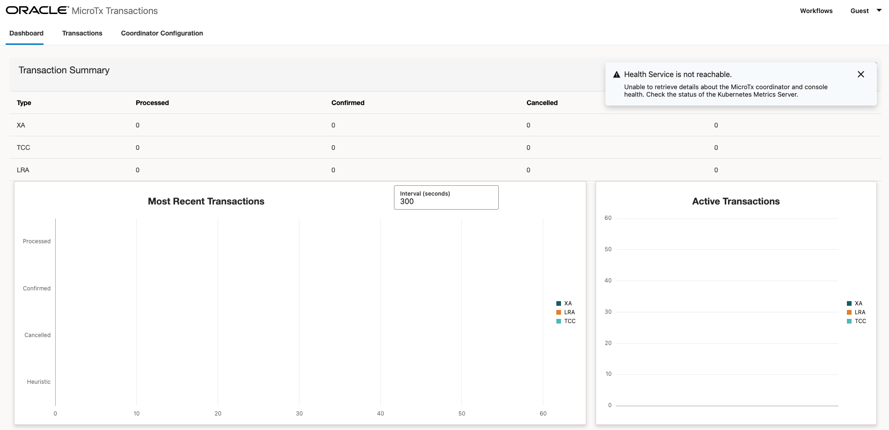

# Oracle Transaction Manager for Microservices (MicroTx) Sample

[MicroTx](https://www.oracle.com/database/transaction-manager-for-microservices/) is a durable workflow orchestration layer supporting agentic AI and distrubted transaction management, integrated with Oracle AI Database.

## Important Files

- [MicroTx docker-compose.yaml](https://github.com/anders-swanson/oracle-database-code-samples/blob/main/microtx-java-sample/docker-compose.yaml): Runs the MicroTx coordinator, workflow server, console, and Oracle AI Database Free on one network.

## Run MicroTx and Oracle AI Database Free

The Docker Compose environment pulls the MicroTx Free images from Oracle Container Registry. MicroTx Free is for developers to build and evaluate applications using distributed transactions and workflows with Agentic AI.

- [MicroTx console image](https://container-registry.oracle.com/ords/ocr/ba/database/microtx-console)
- [MicroTx coordinator image](https://container-registry.oracle.com/ords/ocr/ba/database/microtx-coordinator)
- [MicroTx workflow image](https://container-registry.oracle.com/ords/ocr/ba/database/microtx-workflow)

```bash
docker login container-registry.oracle.com
```

The included `tcs-config.yaml` and `workflow-server-config.properties` files connect MicroTx to Oracle AI Database Free over the shared Compose network. The [configuration notes](https://github.com/anders-swanson/oracle-database-code-samples/blob/main/microtx-java-sample/config/CONFIGURATION.md) describe the database and credential settings.

Start the environment:

```bash
docker compose -f microtx-docker-compose.yaml up -d
docker compose -f microtx-docker-compose.yaml ps
```

The `workflow-key-init` service generates the workflow-server encryption key the first time the environment starts. The key is retained in the `workflow-encryption-key` volume and reused across restarts.

The services are available at:

- MicroTx coordinator health: `http://localhost:9000/health`
- MicroTx workflow server health: `http://localhost:9010/workflow-server/health`
- MicroTx console: `http://localhost:8080/consoleui/`
- Oracle AI Database Free: `localhost:1521/FREEPDB1`

Stop the environment without deleting its database and workflow storage volumes:

```bash
docker compose -f microtx-docker-compose.yaml down
```

Add `--volumes` only when you intentionally want to delete the persisted development data and workflow-server encryption key. Deleting the key prevents the workflow server from decrypting secrets that were encrypted with it.

## Access the MicroTx console UI

```bash
http://localhost:8080/consoleui
```

You should see the microtx dashboard:



## MicroTx Java Application

TBD - stay tuned for a working Java sample that complements the Docker Compose environment.

## MicroTx Enterprise Edition (EE)

The MicroTx EE images are recommended for licensed, production workflows. Find the MicroTx EE images here:

- [MicroTx EE console image](https://container-registry.oracle.com/ords/ocr/ba/database/microtx-ee-console)
- [MicroTx EE coordinator image](https://container-registry.oracle.com/ords/ocr/ba/database/microtx-ee-coordinator)
- [MicroTx EE workflow image](https://container-registry.oracle.com/ords/ocr/ba/database/microtx-ee-workflow)
