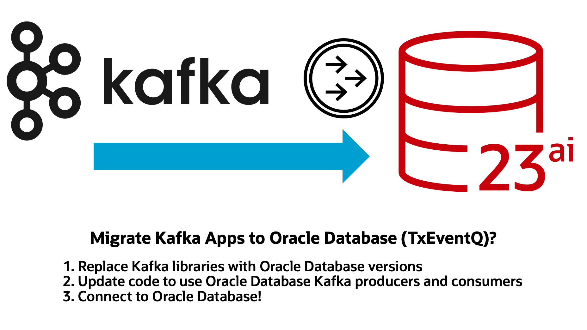

# Migrate Apache Kafka to Oracle Database Transactional Event Queues (TxEventQ)



This module demonstrates progressively migrating an app from Apache Kafka to [TxEventQ](https://oracle.github.io/microservices-datadriven/transactional-event-queues/getting-started/index.html), using the Kafka Java Client for Oracle Database Transactional Event Queues.

The module is broken into three sections:

- First, in this README we'll demonstrate how to migrate a simple Apache Kafka application ([kafka-app](./kafka-app)) to Oracle Database TxEventQ ([kafka-app-step-1](./kafka-app-step-1))
- Next, in the [Using Oracle JSON (OSON)](./using-oracle-json.md) section we'll add support for Oracle's optimized binary JSON format, OSON, to the app ([kafka-app-step-2](./kafka-app-step-2)).
- Finally, in the  [Transactional Messaging](./transactional-messaging.md) section, we further enhance the app to add transactional messaging to the consumer, so that database operations are handled using the same connection the consumer uses to receive messages ([kafka-app-step-3](./kafka-app-step-3)).

To follow this project, start with this README, then proceed to [Using Oracle JSON (OSON)](./using-oracle-json.md), and finally go to [Transactional Messaging](./transactional-messaging.md). The project is checkpointed at each step, in case you get stuck:

- kafka-app module -> Plain Apache Kafka App
- kafka-app-step-1 module -> Migrated Apache Kafka App to TxEventQ
- kafka-app-step-2 module -> Added OSON support
- kafka-app-step-3 module -> Added Transactional Messaging support

## The Kafka App

The [kafka-app](./kafka-app) module contains a simple Apache Kafka application that creates a topic, produces 10 records to a topic, and then consumes those records.

### Running the Kafka App

To run the kafka-app, start an Apache Kafka container like so:

```bash
docker run -p 9092:9092 apache/kafka:4.0.0
```

Then, from the `kafka-app` directory, start the app using Maven: 

```bash
mvn clean compile exec:java
```

You should see output similar to the following, indicating the producer and consumer processed all expected records:

```
[ADMIN] Created topic: test_topic
[MAIN] Started consumer
[MAIN] Started producer
[PRODUCER] Sent: WeatherEvent{, station=Station{id=1}, timestamp=2025-06-03T06:00, temperature=18.2, humidity_percent=81.0, uv_index=0.0}
[PRODUCER] Sent: WeatherEvent{, station=Station{id=1}, timestamp=2025-06-03T08:00, temperature=21.7, humidity_percent=70.3, uv_index=2.5}
[PRODUCER] Sent: WeatherEvent{, station=Station{id=2}, timestamp=2025-06-03T10:00, temperature=25.4, humidity_percent=62.8, uv_index=4.9}
[PRODUCER] Sent: WeatherEvent{, station=Station{id=2}, timestamp=2025-06-03T12:00, temperature=28.6, humidity_percent=51.2, uv_index=7.3}
[PRODUCER] Sent: WeatherEvent{, station=Station{id=3}, timestamp=2025-06-03T14:00, temperature=31.6, humidity_percent=40.5, uv_index=10.5}
[PRODUCER] Sent: WeatherEvent{, station=Station{id=3}, timestamp=2025-06-03T16:00, temperature=30.1, humidity_percent=45.1, uv_index=9.0}
[PRODUCER] Sent: WeatherEvent{, station=Station{id=1}, timestamp=2025-06-03T18:00, temperature=27.0, humidity_percent=57.0, uv_index=3.8}
[PRODUCER] Sent: WeatherEvent{, station=Station{id=2}, timestamp=2025-06-03T20:00, temperature=23.5, humidity_percent=63.3, uv_index=0.9}
[PRODUCER] Sent: WeatherEvent{, station=Station{id=3}, timestamp=2025-06-03T22:00, temperature=20.8, humidity_percent=69.1, uv_index=0.0}
[PRODUCER] Sent: WeatherEvent{, station=Station{id=1}, timestamp=2025-06-04T00:00, temperature=18.6, humidity_percent=74.8, uv_index=0.0}
[PRODUCER] Produced all messages
[CONSUMER] Received: WeatherEvent{, station=Station{id=1}, timestamp=2025-06-03T06:00, temperature=18.2, humidity_percent=81.0, uv_index=0.0}
[CONSUMER] Received: WeatherEvent{, station=Station{id=1}, timestamp=2025-06-03T08:00, temperature=21.7, humidity_percent=70.3, uv_index=2.5}
[CONSUMER] Received: WeatherEvent{, station=Station{id=2}, timestamp=2025-06-03T10:00, temperature=25.4, humidity_percent=62.8, uv_index=4.9}
[CONSUMER] Received: WeatherEvent{, station=Station{id=2}, timestamp=2025-06-03T12:00, temperature=28.6, humidity_percent=51.2, uv_index=7.3}
[CONSUMER] Received: WeatherEvent{, station=Station{id=3}, timestamp=2025-06-03T14:00, temperature=31.6, humidity_percent=40.5, uv_index=10.5}
[CONSUMER] Received: WeatherEvent{, station=Station{id=3}, timestamp=2025-06-03T16:00, temperature=30.1, humidity_percent=45.1, uv_index=9.0}
[CONSUMER] Received: WeatherEvent{, station=Station{id=1}, timestamp=2025-06-03T18:00, temperature=27.0, humidity_percent=57.0, uv_index=3.8}
[CONSUMER] Received: WeatherEvent{, station=Station{id=2}, timestamp=2025-06-03T20:00, temperature=23.5, humidity_percent=63.3, uv_index=0.9}
[CONSUMER] Received: WeatherEvent{, station=Station{id=3}, timestamp=2025-06-03T22:00, temperature=20.8, humidity_percent=69.1, uv_index=0.0}
[CONSUMER] Received: WeatherEvent{, station=Station{id=1}, timestamp=2025-06-04T00:00, temperature=18.6, humidity_percent=74.8, uv_index=0.0}
[CONSUMER] Consumed all messages
[MAIN] Done!
```

## Migrating the Kafka App to TxEventQ

To migrate the app, we'll make three key modifications:

1. The `kafka-clients` dependency in the [pom.xml](./kafka-app/pom.xml) has been replaced with the okafka dependency:

```xml
<!-- OKafka All-in-one -->
<dependency>
    <groupId>com.oracle.database.messaging</groupId>
    <artifactId>okafka</artifactId>
    <version>23.6.0.0</version>
</dependency>
```

2. The AdminClient, KafkaProducer, and KafkaConsumer constructors have been replaced with okafka implementations:

```java
// Use org.oracle.okafka.clients implementations for kafka-clients
import org.oracle.okafka.clients.admin.AdminClient;
import org.oracle.okafka.clients.consumer.KafkaConsumer;
import org.oracle.okafka.clients.producer.KafkaProducer;
```

3. Finally, the connection information for the Apache Kafka cluster is updated to use Oracle Database. Note that the `oracle.net.tns_admin` property should point to the directory containing the Oracle Database wallet. If you're not using a wallet, this directory should contain an `ojdbc.properties` file with the `user` and `password` to connect to the database.

```java
private static Properties connectionProperties() {
    Properties props = new Properties();
    props.setProperty("bootstrap.servers", "localhost:1521");
    props.setProperty("security.protocol", "PLAINTEXT");
    // Database service name / TNS Alias
    props.put("oracle.service.name", "freepdb1");
    // Pass directory containing ojdbc.properties file with username/password
    String resourcesDir = new File(KafkaApp.class.getClassLoader().getResource("").getFile())
            .getAbsolutePath();
    props.put("oracle.net.tns_admin", resourcesDir);
    return props;
}
```

The `ojdbc.properties` file should look like this:

```properties
user = <my db username>
password = <my db password>
```

#### TLS and mTLS Connections?

If you're using SSL instead of PLAINTEXT, use the following connection code for Oracle Database:

```java
private static Properties connectionProperties() {
    Properties props = new Properties();
    props.setProperty("security.protocol", "SSL");
    // TNS Alias
    props.put("oracle.service.name", "testdb_high");
    props.put("tns.alias", "testdb_high");
    // If using Oracle Database wallet, pass wallet directory
    String resourcesDir = new File(KafkaApp.class.getClassLoader().getResource("").getFile())
            .getAbsolutePath();
    props.put("oracle.net.tns_admin", resourcesDir);
    return props;
}
```

### Running the updated app against a local database container

To run the updated app, start an Oracle Database Free container:

```bash
docker run --name oracledb -d -p 1521:1521 -e ORACLE_PASSWORD=testpwd gvenzl/oracle-free:23.8-slim-faststart
```

Next, run the [testuser.sql](./testuser.sql) script against the database as sysdba. This script creates a database user for the app with all necessary grants to create topics and produce/consume messages.

Then, from the `kafka-app` directory, start the app using Maven:

```bash
mvn clean compile exec:java
```

You should see output similar to the following when you run the updated app:

```
[ADMIN] Created topic: test_topic
[MAIN] Started consumer
[MAIN] Started producer
[PRODUCER] Sent: WeatherEvent{, station=Station{id=1}, timestamp=2025-06-03T06:00, temperature=18.2, humidity_percent=81.0, uv_index=0.0}
[PRODUCER] Sent: WeatherEvent{, station=Station{id=1}, timestamp=2025-06-03T08:00, temperature=21.7, humidity_percent=70.3, uv_index=2.5}
[PRODUCER] Sent: WeatherEvent{, station=Station{id=2}, timestamp=2025-06-03T10:00, temperature=25.4, humidity_percent=62.8, uv_index=4.9}
[PRODUCER] Sent: WeatherEvent{, station=Station{id=2}, timestamp=2025-06-03T12:00, temperature=28.6, humidity_percent=51.2, uv_index=7.3}
[PRODUCER] Sent: WeatherEvent{, station=Station{id=3}, timestamp=2025-06-03T14:00, temperature=31.6, humidity_percent=40.5, uv_index=10.5}
[PRODUCER] Sent: WeatherEvent{, station=Station{id=3}, timestamp=2025-06-03T16:00, temperature=30.1, humidity_percent=45.1, uv_index=9.0}
[PRODUCER] Sent: WeatherEvent{, station=Station{id=1}, timestamp=2025-06-03T18:00, temperature=27.0, humidity_percent=57.0, uv_index=3.8}
[PRODUCER] Sent: WeatherEvent{, station=Station{id=2}, timestamp=2025-06-03T20:00, temperature=23.5, humidity_percent=63.3, uv_index=0.9}
[PRODUCER] Sent: WeatherEvent{, station=Station{id=3}, timestamp=2025-06-03T22:00, temperature=20.8, humidity_percent=69.1, uv_index=0.0}
[PRODUCER] Sent: WeatherEvent{, station=Station{id=1}, timestamp=2025-06-04T00:00, temperature=18.6, humidity_percent=74.8, uv_index=0.0}
[PRODUCER] Produced all messages
[CONSUMER] Received: WeatherEvent{, station=Station{id=1}, timestamp=2025-06-03T06:00, temperature=18.2, humidity_percent=81.0, uv_index=0.0}
[CONSUMER] Received: WeatherEvent{, station=Station{id=1}, timestamp=2025-06-03T08:00, temperature=21.7, humidity_percent=70.3, uv_index=2.5}
[CONSUMER] Received: WeatherEvent{, station=Station{id=2}, timestamp=2025-06-03T10:00, temperature=25.4, humidity_percent=62.8, uv_index=4.9}
[CONSUMER] Received: WeatherEvent{, station=Station{id=2}, timestamp=2025-06-03T12:00, temperature=28.6, humidity_percent=51.2, uv_index=7.3}
[CONSUMER] Received: WeatherEvent{, station=Station{id=3}, timestamp=2025-06-03T14:00, temperature=31.6, humidity_percent=40.5, uv_index=10.5}
[CONSUMER] Received: WeatherEvent{, station=Station{id=3}, timestamp=2025-06-03T16:00, temperature=30.1, humidity_percent=45.1, uv_index=9.0}
[CONSUMER] Received: WeatherEvent{, station=Station{id=1}, timestamp=2025-06-03T18:00, temperature=27.0, humidity_percent=57.0, uv_index=3.8}
[CONSUMER] Received: WeatherEvent{, station=Station{id=2}, timestamp=2025-06-03T20:00, temperature=23.5, humidity_percent=63.3, uv_index=0.9}
[CONSUMER] Received: WeatherEvent{, station=Station{id=3}, timestamp=2025-06-03T22:00, temperature=20.8, humidity_percent=69.1, uv_index=0.0}
[CONSUMER] Received: WeatherEvent{, station=Station{id=1}, timestamp=2025-06-04T00:00, temperature=18.6, humidity_percent=74.8, uv_index=0.0}
[CONSUMER] Consumed all messages
[MAIN] Done!
```

### [Next: Adding Oracle JSON support (OSON)](./using-oracle-json.md)

In the next section, we'll explore adding [OSON](./using-oracle-json.md), an optimized binary JSON format, to the app.

