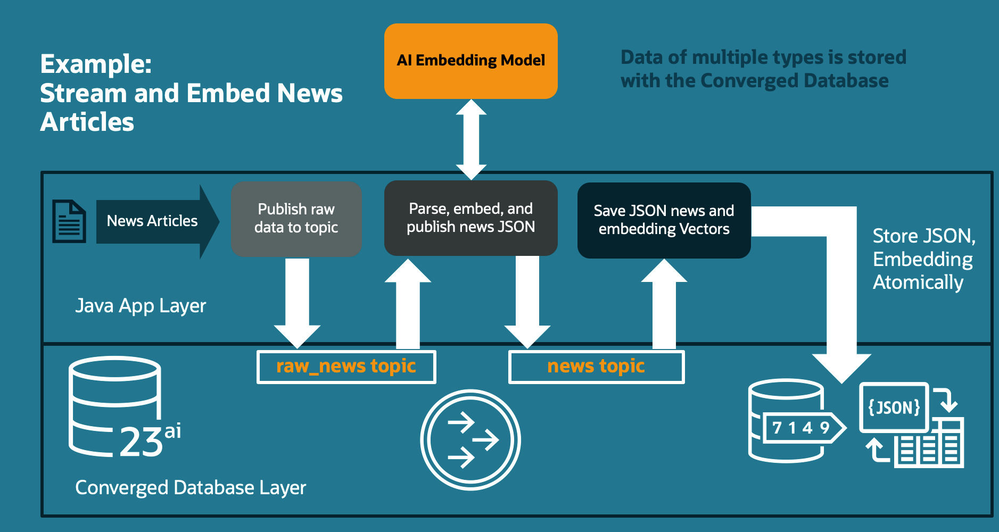
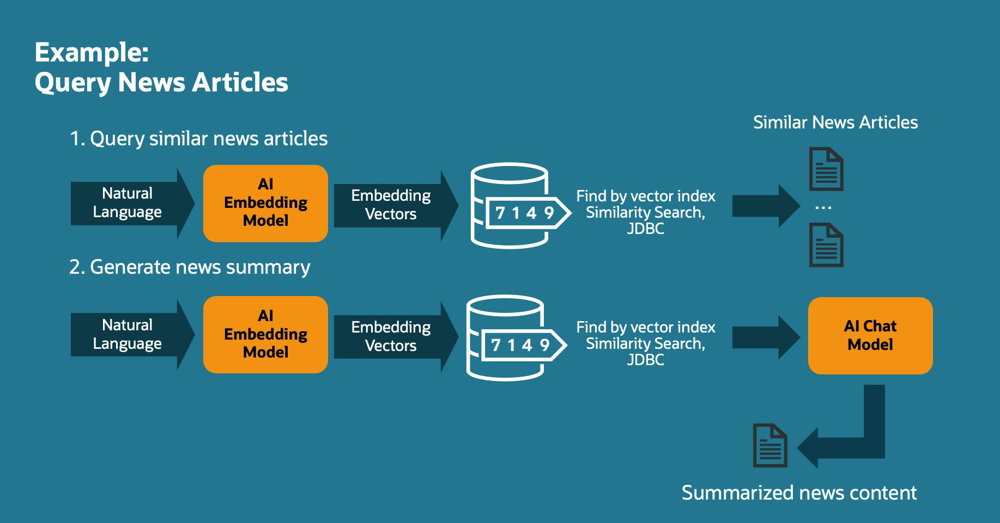
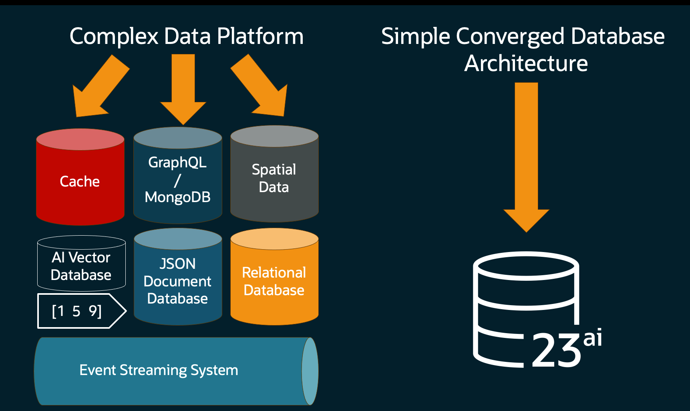

# News Event Streaming Application 

This demo application streams news articles as events from a REST API, processing those articles and storing them in a multimodal database that includes relational, document, event, and vector data types.

You can use this README to get started, or follow the [in-depth blog post](https://medium.com/@anders.swanson.93/building-a-converged-database-java-application-with-spring-boot-d3b3cabbf613).



Processed news articles can be queried over REST using vector similarity search, for a plain query or an LLM-enhanced summarization query. 



The News Event Streaming Application makes use of the following (4) Oracle Database features, in addition to OCI GenAI apis for text embedding and chat:

1. Relational data schemas: `news` and `news_vector` tables are created to store news articles and their vector embeddings. A news article may have one or more vector embeddings, depending on the size of the article.
2. [JSON Relational Duality Views](https://docs.oracle.com/en/database/oracle/oracle-database/23/jsnvu/overview-json-relational-duality-views.html): The `news` and `news_vector` tables are combined in a read-write duality view that gives document style access to data from both tables.
3. [Transactional Event Queues](https://docs.oracle.com/en/database/oracle/oracle-database/23/adque/aq-introduction.html): We stream news articles using the [Kafka Java Client for Oracle Database Transactional Event Queues](https://github.com/oracle/okafka), with topic for raw news, and a topic for parsed news JSON data (including vector embeddings).
4. [Vector Data and Similarity Search](https://www.oracle.com/database/ai-vector-search/): Using news article vector embeddings and the NewsService REST API, we can query for news articles that are similar in meaning to an input text. We can also summarize news articles similar to an input query by combing vector search with an OCI GenAI chat model!

> What's neat about this? Each of the above features runs within the same database engine. It  works on [Oracle Database Free](https://medium.com/@anders.swanson.93/oracle-database-23ai-free-11abf827ab37), which I used to test this application in a local container instance.



##### Stay tuned for an in-depth blog post that covers this application in detail!

## Running the application

Prerequisites:
- Maven
- Java 21+
- Docker (Optional)

#### Database and Schema

The app requires access to an Oracle Database instance. The default configuration assumes a local containerized database running on port `1521`. You can replicate this configuration by starting an Oracle Database Free container:

```bash
docker run --name oracledb -d -p 1521:1521 -e ORACLE_PASSWORD=testpwd gvenzl/oracle-free:23.6-slim-faststart
```

After a few moments, the database should start up. Once your database is ready, run the [testuser.sql](./src/test/resources/testuser.sql) and [news-schema.sql](./src/test/resources/news-schema.sql) scripts to create a user, grants, tables, and duality view required by the application. A companion cleanup script, [cleanup.sql](./src/test/resources/cleanup.sql), is provided to delete the tables, duality view, and topics used by the app.

> If you don't have Docker or for some reason can't run Oracle Database locally, Autonomous Database is available in the [OCI Always Free Tier](https://signup.cloud.oracle.com/)

#### App configuration

You'll need to set the following environment variables where your application is running, or provide these values in the [application properties file](./src/main/resources/application.yaml)

- `OJDBC_PATH`: Path to the directory containing your `ojdbc.properties` file. I use the ojdbc.properties file in [src/test/resources](./src/test/resources).
- `OCI_COMPARTMENT_ID`: OCI Compartment OCID where your GenAI models are found. You can find this on the OCI console.
- `OCI_CHAT_MODEL_ID`: OCI Chat Model OCID. You can find this on the OCI GenAI console.
- `OCI_EMBEDDING_MODEL_ID`: OCI Embedding Model OCID. You can find this on the OCI GenAI console.

Once these values are configured, start the application like so:

```bash
mvn spring-boot:run
```

## Stream News Data

In this section, we'll stream news article data from the [CNN Dailymail dataset](https://huggingface.co/datasets/abisee/cnn_dailymail). You can find test data files in the `src/test/resources` directory.

Using the NewsService REST API, we'll insert one or more of these news article. POSTing news article data goes through the following processing steps:

1. Send the raw article data to the `news_raw` topic.
2. Read from the `news_raw` topic, parsing, chunking, and embedding news article content.
   3. News article chunk embedding is powered by OCI GenAI.
3. Write JSON news articles, including their embeddings, to the `news_parsed` topic.
4. Read from the `news_parsed` topic, and write the JSON from (3) to the `news_dv` JSON Relational Duality View.

### POST a single article

```bash
curl -X POST "http://localhost:8080/news" \
  -H "Content-Type: application/json" \
  -d "@src/test/resources/one-record.json"
```

### POST a small batch of articles

Ingest a subset of the news dataset.

```bash
curl -X POST "http://localhost:8080/news" \
  -H "Content-Type: application/json" \
  -d "@src/test/resources/input-small.json"
```

### POST a large batch of articles

#### WARNING: The large data set contains almost 12,000 records. Before running this, ensure you're comfortable with issuing approximately 25,000 text embedding requests.

```bash
curl -X POST "http://localhost:8080/news" \
  -H "Content-Type: application/json" \
  -d "@src/test/resources/input-data.json"
```

## Try out Similarity Search 

### Find news articles similar to an input query

```bash
curl -X GET "http://localhost:8080/news" \
  -H "Content-Type: application/json" \
  -d '{"input": "Large Hadron Collider particle accelerator", "minScore": 0.2}'
```

Sample output:
> `{"articles":[{"id":"e45bc7b6-6e5f-45e5-94c7-66c363460c74","article":"(CNN)The world's biggest and most powerful physics experiment... ]}`

### Summarize an article by ID

```bash
# Use your own ID in the path!
curl -X POST "http://localhost:8080/news/summarize/e45bc7b6-6e5f-45e5-94c7-66c363460c74"
```

Sample output: 
> The Large Hadron Collider (LHC), the world's largest particle accelerator, has restarted after a two-year shutdown. The LHC aims to recreate conditions after the Big Bang, helping scientists understand the universe's evolution. With a cost of €3 billion, it generates an immense number of particles, allowing researchers to explore unanswered questions in physics, such as the origin of mass and the nature of dark matter.

### Summarize by input query

```bash
curl -X POST "http://localhost:8080/news/summarize" \
  -H "Content-Type: application/json" \
  -d '{"input": "Large Hadron Collider particle accelerator", "minScore": 0.2}'
```

Output should be similar to above, depending on temperature.

## Truncate data (cleanup all embeddings and data)

```bash
curl -X POST "http://localhost:8080/news/reset"
```


