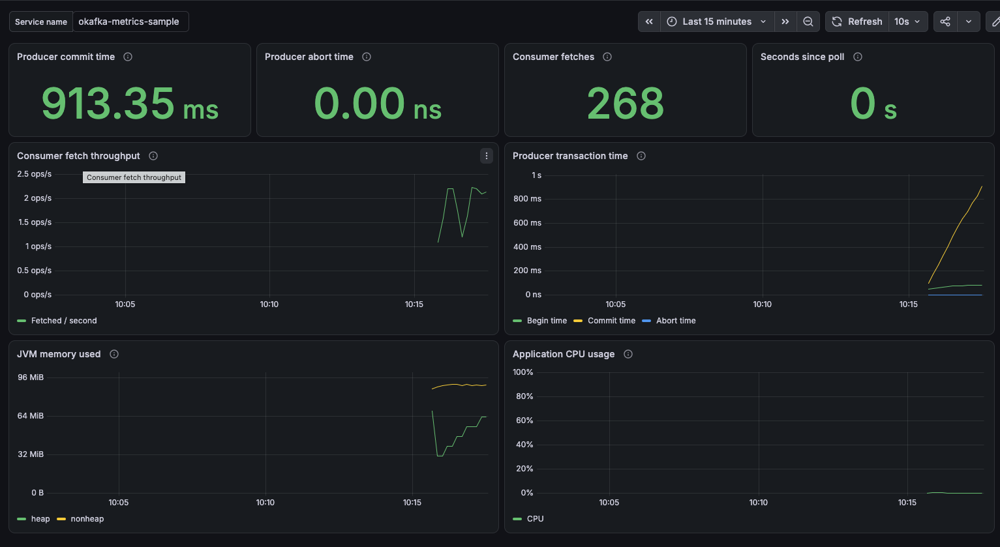

# Oracle AI Database Kafka APIs

The following articles describe using Kafka Java APIs with Oracle AI Database Transactional Event Queues:

- [Transactional Messaging with the Kafka Java Client for Oracle AI Database Transactional Event Queues](https://medium.com/@anders.swanson.93/using-transactional-kafka-apis-with-oracle-database-70f58598a176)
- [Produce and consume messages with the Kafka Java Client for Oracle AI Database Transactional Event Queues](https://medium.com/@anders.swanson.93/seamlessly-stream-data-with-kafka-apis-for-oracle-79db9ce02dc0)

### Running the Oracle AI Database Kafka API tests

The tests in this package demonstrate using the Kafka Java Client for Oracle AI Database Transactional Event Queues to produce and consume messages. The tests use `oracle-spring-boot-testcontainers` with the official Oracle AI Database Free image (`container-registry.oracle.com/database/free:latest-lite`) to run locally on a Docker-compatible environment with Java 21. The JUnit Testcontainers extension starts and stops each test class's container.

Prerequisites:
- Java 21
- Maven
- Docker

Once your docker environment is configured, you can run the integration tests with maven:


1. To demonstrate producing and consuming messages from a Transactional Event Queue topic using Kafka APIs, run the OKafkaExampleIT test.
```shell
mvn integration-test -Dit.test=OKafkaExampleIT
```

2. To demonstrate a transactional producer, run the TransactionalProduceIT test. With a transactional producer, messages are only produced if the producer successfully commits the transaction.
```shell
mvn integration-test -Dit.test=TransactionalProduceIT
```

3. To demonstrate a transactional consumer, run the TransactionalConsumeIT test.
```shell
mvn integration-test -Dit.test=TransactionalConsumeIT
```

To run all the Transactional Event Queue Kafka API tests and check their results, run `mvn verify`.

### OKafka metrics, tracing, and logs with Spring Boot Actuator and OpenTelemetry

The `com.example.metrics` package contains a Spring Boot sample for `kafka-clients` metrics, tracing, and logs with OKafka. The sample exports OpenTelemetry observability data from transactional OKafka producers and consumers, so you can see how these components are functioning in real time.

These metrics are useful for monitoring applications using Oracle AI Database's Kafka Java APIs.

The sample combines Kafka Java API operations and SQL in Oracle AI Database transactions, with
metrics, traces, and correlated logs showing the work. No separate Kafka broker is required.

The scheduled producer and polling consumer demonstrate these transaction outcomes:

1. Publish an event every 500 ms. When a random number in `[0, 1)` is greater than `0.9` (10% of
   events), publish `sensor-reading-aborted`; otherwise, publish a numbered sensor reading.
2. Insert regular readings using `producer.getDBConnection()` and call `commitTransaction()` to
   commit the events and SQL together. Failure markers are committed events with no SQL reading row.
3. Poll the readings and update their `consumed_at` timestamps using `consumer.getDBConnection()`.
   When a batch contains a failure marker, roll back that connection once. The updates disappear
   and the events remain available for consumption.
4. Poll again and call `commitSync()` after the SQL updates, acknowledging the failure marker and
   committing consumption and the updates together. Later marker batches repeat this failure simulation.

[MetricsSample](https://github.com/anders-swanson/oracle-database-code-samples/blob/main/oracle-database-kafka-apis/src/main/java/com/example/metrics/MetricsSample.java)
uses only the scheduled producer to publish readings. The application thread polls and consumes
them continuously, rolling back each batch containing a failure marker once before committing its retry. SQL runs through the
client's own database connection; no separate JDBC connection or distributed transaction manager
participates in those transactions. Stop the application with Ctrl+C to end the workload.

The startup SQL creates `OKAFKA_METRICS_READINGS` before the application starts. Rows are keyed
by a run ID and reading, so restarting the application preserves earlier runs. The current run ID is
printed in the startup logs. Connect as `TESTUSER` to inspect committed state:

```sql
select run_id, count(*) as produced, count(consumed_at) as consumed
from OKAFKA_METRICS_READINGS
group by run_id;

select run_id, reading, produced_at, consumed_at
from OKAFKA_METRICS_READINGS
where reading = 'sensor-reading-aborted';
```

The second query returns no rows because failure markers have no SQL reading row. Failure simulation
is isolated to the consumer; every scheduled producer transaction commits unless a real operation fails.
These guarantees cover the queue operations and SQL performed in the same Oracle AI Database transaction.

The [MetricsApplication](https://github.com/anders-swanson/oracle-database-code-samples/blob/main/oracle-database-kafka-apis/src/main/java/com/example/metrics/MetricsApplication.java)
registers Micrometer `KafkaClientMetrics` binders for OKafka's standard `metrics()` API. Spring Boot
binds these to the same `MeterRegistry` as Actuator's JVM and application metrics and exports them
through its auto-configured OTLP registry. Metrics also appear at `/actuator/metrics`.
Spring closes the binders and their refresh schedulers during application shutdown.

The sample uses `spring-boot-starter-opentelemetry` for telemetry.
It includes Micrometer's OTLP registry and `micrometer-tracing-bridge-otel`; the latter bridges tracing,
while metrics use Micrometer's registry directly. No custom OpenTelemetry SDK metric provider,
exporter, or Kafka instrumentation dependency is needed. See
[Spring Boot's OpenTelemetry documentation](https://docs.spring.io/spring-boot/reference/actuator/observability.html#actuator.observability.opentelemetry.support).
The Kafka binders instrument client metrics. The sample supplies Micrometer `SenderContext` and
`ReceiverContext` adapters for Kafka headers; Spring Boot's tracing handlers automatically create
an `okafka.produce` producer span, inject trace context into the record headers, and extract it for
an `okafka.process` consumer span with the same trace ID and the producer span as parent.
Each reading is processed in its own observation because a poll can contain records from different traces.
Empty polls create no spans. The sample needs no manual `Tracer` calls or custom tracing handlers.
The configured sampling probability is `0.1`; set `management.tracing.sampling.probability=1`
to see every trace locally.

For logs, `opentelemetry-logback-appender-1.0` and
[logback-spring.xml](https://github.com/anders-swanson/oracle-database-code-samples/blob/main/oracle-database-kafka-apis/src/main/resources/logback-spring.xml)
forward Logback records to Spring Boot's OpenTelemetry instance while retaining console output.
[MetricsApplication](https://github.com/anders-swanson/oracle-database-code-samples/blob/main/oracle-database-kafka-apis/src/main/java/com/example/metrics/MetricsApplication.java)
connects the appender during startup. `Published` and `Processed` logs carry their respective producer
and consumer span IDs within the same trace. Batch commit and rollback logs are outside those per-record
observations; a `Processed` log describes SQL processing before the batch commits.
Spring Boot manages the trace and log exporters; no custom SDK provider or exporter is created.
See [Spring Boot's logging documentation](https://docs.spring.io/spring-boot/reference/actuator/loggers.html#actuator.loggers.opentelemetry).

#### Run the sample

Run these commands from `oracle-database-kafka-apis/`.

1. Start Oracle AI Database Free and Grafana LGTM with Docker Compose. LGTM includes an
   OpenTelemetry Collector, Prometheus for metrics, and Grafana with preconfigured data sources:

```shell
docker compose up -d --wait
```

   Compose uses `container-registry.oracle.com/database/free:latest-lite`. Its
   [startup script](https://github.com/anders-swanson/oracle-database-code-samples/blob/main/oracle-database-kafka-apis/docker/init.sql)
   creates the `USERS` tablespace and `TESTUSER` with password `Welcome123#` in `FREEPDB1`, then runs the mounted
   [okafka.sql](https://github.com/anders-swanson/oracle-database-code-samples/blob/main/oracle-database-kafka-apis/src/test/resources/okafka.sql)
   to grant TxEventQ privileges and create `OKAFKA_METRICS_READINGS` if it is missing. `ORACLE_PWD` sets the administrator password. The startup script
   also runs on subsequent starts and preserves an existing user. The health check verifies that
   `TESTUSER` can connect and query a required OKafka view and the readings table. The database listens on `localhost:1521`.

2. Run the sample against the Compose database:

```shell
mvn spring-boot:run
```

`MetricsApplication` defaults `okafka.tns-admin` to `src/test/resources`, which contains
`ojdbc.properties` with the Compose user's credentials. The path is relative to the working directory,
so run the application from `oracle-database-kafka-apis/`.

3. Inspect Actuator in another terminal:

```shell
curl http://localhost:8080/actuator/health
curl http://localhost:8080/actuator/metrics
```

Open [Grafana](http://localhost:3000) and sign in with `admin` / `admin`. Compose provisions the
[OKafka Metrics Sample dashboard](http://localhost:3000/d/okafka-metrics-sample) and sets it as the
home dashboard. It shows native producer begin/commit/abort timings, consumer fetch counts and
throughput, time since the last consumer poll, JVM memory, and CPU usage. The **Service name** field defaults to `okafka-metrics-sample`;
change it if you set `OTEL_SERVICE_NAME`. Rates need multiple exports, so allow about a minute for
the throughput panels to populate. The dashboard refreshes every ten seconds.



The dashboard's
[JSON source](https://github.com/anders-swanson/oracle-database-code-samples/blob/main/oracle-database-kafka-apis/docker/grafana/dashboards/okafka-metrics.json)
can also be imported into another Grafana instance using a Prometheus data source with UID `prometheus`.

In **Explore**, select
the **Prometheus** data source and query `kafka_consumer_fetch_manager_records_consumed_total` or
`kafka_producer_txn_commit_time_ns_total`. Prometheus converts the OpenTelemetry metric names from dots to
underscores. Actuator JVM metrics are available in the same data source.

For traces, select **Tempo** and use TraceQL `{resource.service.name = "okafka-metrics-sample"}`
to find the `okafka.produce` and `okafka.process` spans in the same trace. For logs, select **Loki**
and query `{service_name="okafka-metrics-sample"}`. A reading's `Published` and `Processed` logs
share its trace ID.

Grafana uses port 3000; OTLP gRPC and HTTP use ports 4317 and 4318. All three are bound to localhost.
Metrics, traces, and logs use OTLP HTTP on `http://localhost:4318` with the respective
`/v1/metrics`, `/v1/traces`, and `/v1/logs` paths. See [Grafana's Docker LGTM documentation](https://grafana.com/docs/opentelemetry/docker-lgtm/).

When you're done, remove both container services with `docker compose down`.

#### Configuration and available metrics

Configuration used:

| Property | Default | Purpose |
| --- | --- | --- |
| `okafka.tns-admin` | `src/test/resources` | Wallet and `ojdbc.properties` directory, relative to the working directory |
| `management.otlp.metrics.export.url` | `http://localhost:4318/v1/metrics` | OTLP HTTP endpoint for OKafka and Actuator metrics |
| `management.otlp.metrics.export.step` | `10s` | Metric export interval |
| `management.opentelemetry.tracing.export.otlp.endpoint` | `http://localhost:4318/v1/traces` | OTLP HTTP trace endpoint |
| `management.opentelemetry.logging.export.otlp.endpoint` | `http://localhost:4318/v1/logs` | OTLP HTTP log endpoint |
| `management.tracing.sampling.probability` | `0.1` | Sample 10% of traces; set to `1` to see every trace locally |
| `spring.application.name` | `okafka-metrics-sample` | Default service identity; `OTEL_SERVICE_NAME` overrides the telemetry service name |

Metrics:

| Example metric | Meaning |
| --- | --- |
| `kafka.producer.txn.begin.time.ns.total` | Cumulative time spent beginning transactions, in nanoseconds |
| `kafka.producer.txn.commit.time.ns.total` | Cumulative time spent committing transactions, in nanoseconds |
| `kafka.producer.txn.abort.time.ns.total` | Cumulative time spent aborting transactions, in nanoseconds |
| `kafka.consumer.fetch.manager.records.consumed.total` | Consumer fetches, including records fetched again after rollback |
| `kafka.consumer.fetch.manager.bytes.consumed.total` | Bytes fetched by the consumer |
| `kafka.consumer.fetch.manager.fetch.latency.avg` | Average fetch latency |
| `kafka.consumer.last.poll.seconds.ago` | Seconds since the last poll |

The transactional producer exposes transaction timings rather than the asynchronous producer's
send/error/buffer metrics. It sends synchronously, so the sample does not call `flush()`.
Producer transaction timings measure time spent in the native transaction API calls; they do not
count messages or include all SQL processing time. Consumer fetch counters include records fetched
again after rollback and can exceed committed counts. The sample registers no custom counters for
transaction outcomes or committed readings. Use the SQL queries against `OKAFKA_METRICS_READINGS`
to inspect committed business state, and use batch logs to distinguish commit and rollback.

Client IDs (`metrics-producer` and `metrics-consumer`) identify the clients; topic tags are included
where the client exposes them. The Micrometer binder selects the most detailed available dimensions to
avoid counting both client totals and per-topic totals for the same records.

#### Verify metric export

```shell
mvn test -Dtest=MetricsInstrumentationTest
```

This test provisions Oracle AI Database Free, runs the Spring Boot sample, and decodes actual OTLP HTTP
protobuf requests. It checks producer and consumer metrics, verifies that a consumer span shares its
producer trace ID and references the producer span as parent, and checks log correlation on both sides.
The test supplies its own local OTLP receiver, so it does not require a running Collector. Run `mvn verify` to include the existing
transactional messaging tests.
