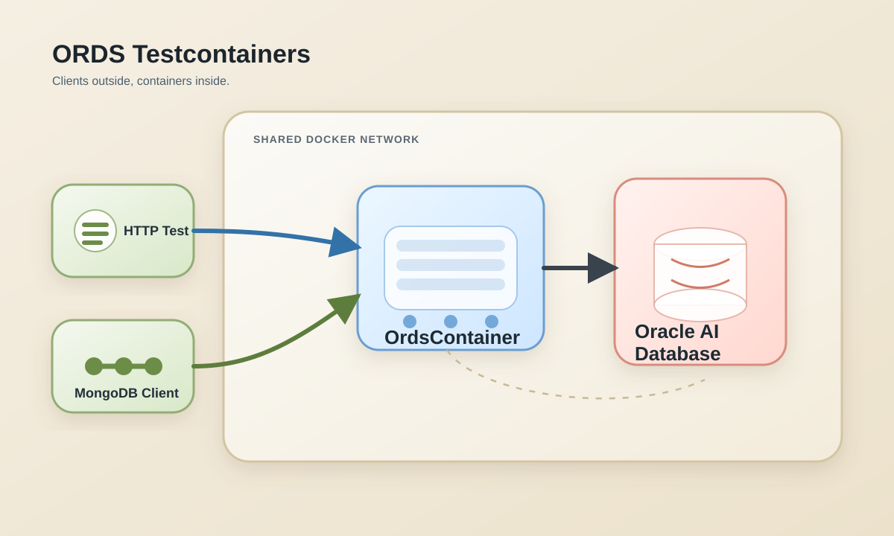

# ORDS Testcontainers

This module demonstrates how to run Oracle REST Data Services (ORDS) with Testcontainers against an Oracle AI Database Free container.

The sample mirrors the [ords-docker-compose](../ords-docker-compose/README.md) module, but replaces Docker Compose with a custom Java `GenericContainer` implementation that can be reused in integration tests.



## Prerequisites

- Java 21+ 
- Maven
- Docker-compatible container runtime
- Access to `container-registry.oracle.com/database/ords:latest`

## Run the sample

```bash
mvn test
```

## What the sample covers

- Starting an Oracle AI Database Free container on a shared Docker network
- Bootstrapping an `ordsuser/ordsuserpwd` schema with a sysdba SQL script
- Starting an ORDS container with a custom `OrdsContainer`
- Waiting for ORDS to become reachable over HTTP
- Enabling the test schema for ORDS before container startup completes
- Validating MongoDB Java client CRUD compatibility through the ORDS MongoDB API

The ORDS container exposes HTTP on internal port `8080` and the MongoDB API on internal port `27017`.
