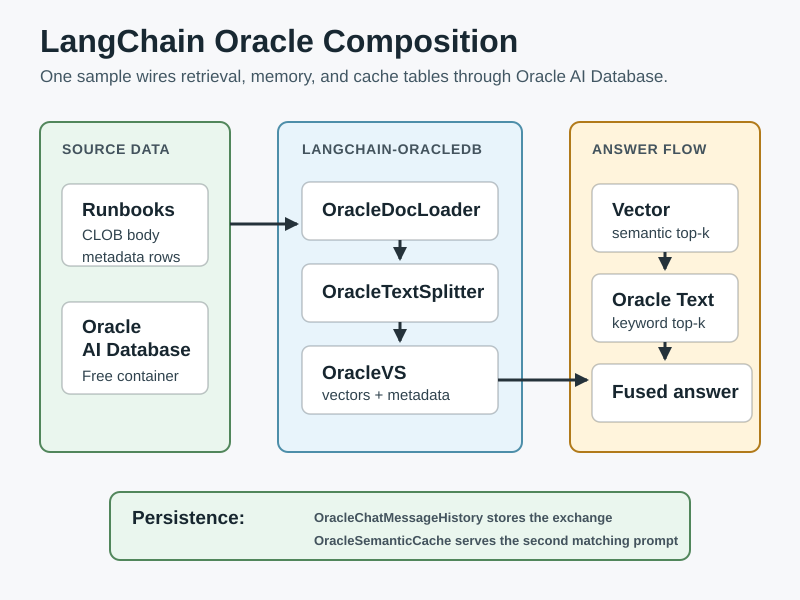
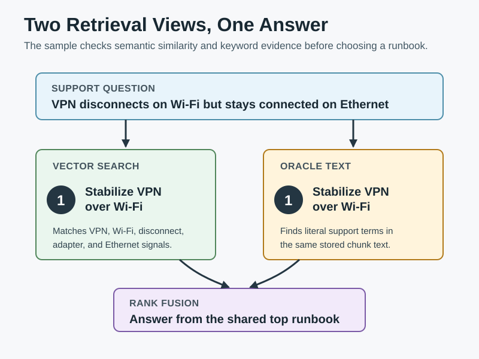
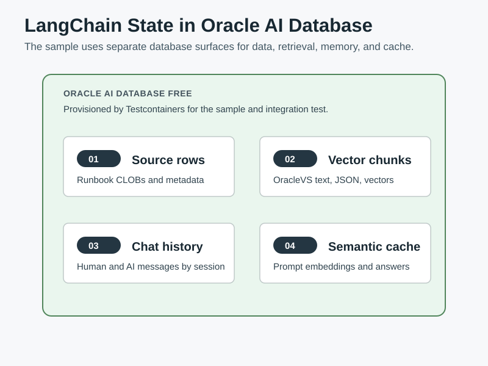

# LangChain Retrieval

This sample shows how several `langchain-oracledb` components work together in one small support-runbook workflow on Oracle AI Database.

The sample starts Oracle AI Database Free with Testcontainers, loads runbook rows through `OracleDocLoader`, chunks text with `OracleTextSplitter`, stores the chunks in `OracleVS`, searches the same stored chunks with vector search and Oracle Text, writes the final exchange with `OracleChatMessageHistory`, and reuses the generated answer through `OracleSemanticCache`.

The embedding model uses `sentence-transformers/all-MiniLM-L6-v2` through Python `sentence-transformers`. It keeps the sample runnable without OpenAI or OCI credentials while using a real local embedding model instead of a sample-only vectorizer.

## Diagrams







## Prerequisites

- Python 3.13+
- Poetry
- Docker compatible environment
- Network access on first run so `sentence-transformers` can download `sentence-transformers/all-MiniLM-L6-v2`, unless the model is already cached

Install dependencies from the `python-oracle/` directory:

```bash
poetry install
```

## Run it

From `python-oracle/`:

```bash
poetry run python src/python_oracle/langchain_retrieval/runbook_retrieval.py
```

The script starts the full Oracle AI Database Free image because the sample creates an Oracle Text index and uses `DBMS_VECTOR_CHAIN` for chunking. The Testcontainers path intentionally uses exact vector search over the tiny fixture rather than creating an HNSW index, which avoids `ORA-51962` vector memory pressure in small Free containers.

Expected output is similar to:

```text
#### Loaded runbooks into Oracle AI Database ####
Source runbooks: 4
Vector chunks:   12

#### Retrieval ####
Question:      My VPN disconnects every few minutes on Wi-Fi, but it stays connected on Ethernet. What should I try?
Semantic top:  Stabilize VPN over Wi-Fi
Keyword top:   Stabilize VPN over Wi-Fi
Fused top:     Stabilize VPN over Wi-Fi

#### Response Persistence ####
For: My VPN disconnects every few minutes on Wi-Fi, but it stays connected on Ethernet. What should I try?
Use runbook: Stabilize VPN over Wi-Fi.
Why: it matches the network product area and says to Use this runbook when a VPN client disconnects every few minutes on Wi-Fi but stays connected on Ethernet.

Chat history messages: 2
Second lookup used OracleSemanticCache: True
```

The chunk count may vary if Oracle AI Database chunking behavior changes, but it should be greater than the four source runbooks.

## Run the test

From the `python-oracle/` directory:

```bash
poetry run python -m unittest tests.test_langchain_retrieval -v
```

The test provisions Oracle AI Database Free with Testcontainers, runs the sample end to end, and verifies:

- `OracleDocLoader` loaded the four source runbooks.
- `OracleTextSplitter` produced more chunks than source rows.
- `OracleVS` vector search chooses `Stabilize VPN over Wi-Fi` for the VPN question.
- `OracleTextSearchRetriever` chooses the same runbook through Oracle Text.
- metadata filtering keeps the network runbook and excludes it for the wrong product.
- `OracleChatMessageHistory` stores the human and AI messages in order.
- `OracleSemanticCache` serves the second answer without adding duplicate chat history.

## Files to inspect

- [runbook_retrieval.py](https://github.com/anders-swanson/oracle-database-code-samples/blob/main/python-oracle/src/python_oracle/langchain_retrieval/runbook_retrieval.py)
- [setup_runbooks.sql](https://github.com/anders-swanson/oracle-database-code-samples/blob/main/python-oracle/src/python_oracle/langchain_retrieval/setup_runbooks.sql)
- [test_langchain_retrieval.py](https://github.com/anders-swanson/oracle-database-code-samples/blob/main/python-oracle/tests/test_langchain_retrieval.py)
