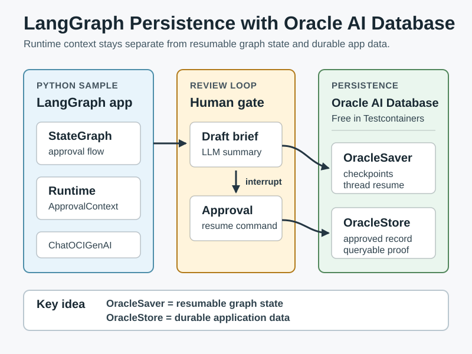
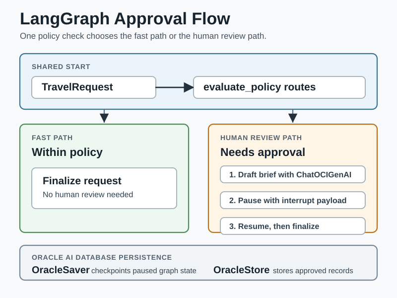

# LangGraph Persistence with Oracle AI Database

This sample shows a LangGraph travel approval workflow that persists graph state in Oracle AI Database with `langgraph-oracledb`.

The workflow keeps the policy decision deterministic: a numeric cost comparison decides whether the request needs a human approval. OCI Generative AI is used where it adds value: drafting a concise approval brief from the request and policy result before the graph pauses. LangGraph checkpoints that brief in Oracle AI Database, resumes the same `thread_id` after the approval decision, and stores the approved record with the request, decision, policy reason, and brief.

## Architecture Diagrams

These diagrams show how the Python sample, LangGraph, OracleSaver, OracleStore, Testcontainers, OCI chat, and Oracle AI Database fit together.





## Prerequisites

- Python 3.13+
- Poetry
- Docker compatible environment
- Local OCI configuration for OCI Generative AI on-demand chat

Install dependencies from the `python-oracle/` directory:

```bash
poetry install
```

Set the OCI compartment before running the command-line sample:

```bash
export OCI_COMPARTMENT_ID=<your-compartment-ocid>
```

The sample assumes an OCI Generative AI on-demand model and defaults to the model alias `cohere.command-latest`. It builds the regional service endpoint from the `region` in your `DEFAULT` OCI config profile, so no dedicated AI cluster endpoint is required.

## Run the Sample

From the `python-oracle/` directory:

```bash
poetry run python src/python_oracle/langgraph_persistence/travel_approval_graph.py
```

The script starts Oracle AI Database Free with Testcontainers, creates the LangGraph checkpoint and store tables, drafts an OCI-generated approval brief, runs the request until LangGraph interrupts for approval, resumes the graph with an approval decision, and prints the final outcome.

## Files to Inspect

- [travel_approval_graph.py](https://github.com/anders-swanson/oracle-database-code-samples/blob/main/python-oracle/src/python_oracle/langgraph_persistence/travel_approval_graph.py)
