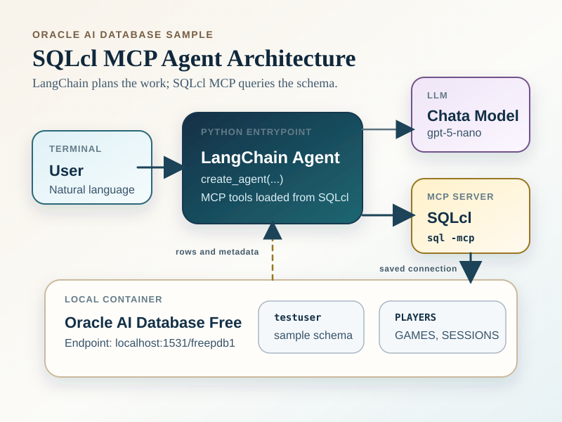
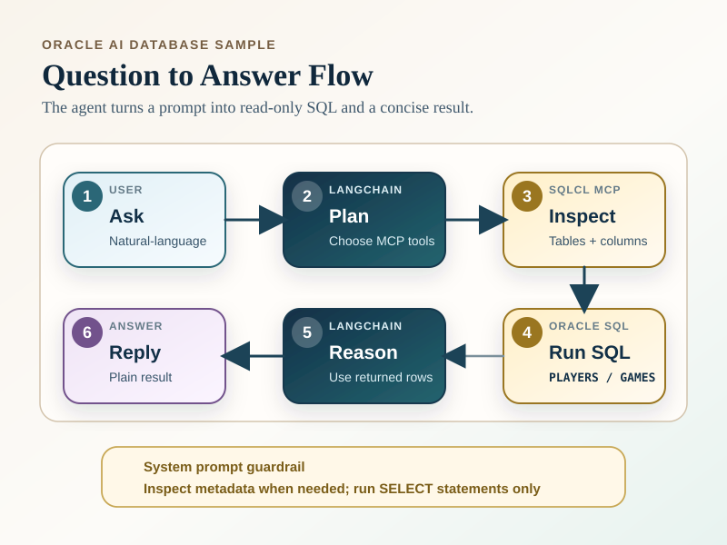

# SQLcl MCP Agent

This sample starts [SQLcl](https://www.oracle.com/database/sqldeveloper/technologies/sqlcl/download/) as an MCP server and lets a LangChain Python agent answer natural-language questions against an Oracle AI Database schema.

## Architecture Diagrams

These diagrams show how the Python agent, LangChain, SQLcl MCP, and Oracle AI Database fit together in this sample.





## Prerequisites

- Docker and Docker Compose
- Poetry
- Python 3.13 or higher
- Java runtime for SQLcl
- SQLcl 26.1 or higher, installed and available on `PATH`
- [`OPENAI_API_KEY` set in your environment](https://platform.openai.com/) as your OpenAI API key

Run commands from the `python-oracle` directory.

## 1. Install Dependencies

```bash
poetry install
```

## 2. Start Oracle AI Database Free

```bash
docker compose -f src/python_oracle/mcp_agent/docker-compose.yml up -d
```

The Docker Compose file starts an Oracle AI Database Free container on `localhost:1531/freepdb1`. The initialization script creates the `testuser` schema, grants permissions, creates `PLAYERS`, `GAMES`, and `GAME_SESSIONS`, and inserts sample data using the [grant_permissions.sql](oracle/grant_permissions.sql) script.

The admin password is `Welcome12345`. The sample user is `testuser/testpwd`.

## 3. Save a SQLcl Connection

SQLcl MCP uses saved SQLcl connections. Save the sample connection once:

```bash
sql /nolog
```

Then run this SQLcl command to save the MCP user connection string:

```sql
conn -save python_mcp -savepwd testuser/testpwd@//localhost:1531/freepdb1
exit
```

## 4. Run the Agent

For an interactive terminal loop:

```bash
OPENAI_API_KEY=<your-openai-api-key> poetry run python src/python_oracle/mcp_agent/sqlcl_mcp_agent.py --connection python_mcp
```

For a single question:

```bash
OPENAI_API_KEY=<your-openai-api-key> poetry run python src/python_oracle/mcp_agent/sqlcl_mcp_agent.py --connection python_mcp --question "List the top 10 players by score."
```

Try prompts like:

- `List the top 10 players by score.`
- `Show average session duration by country.`
- `Which games released after 2010 have the most sessions?`

Type `exit` or `quit` to stop the interactive loop.

For example, using the prompt `Which games released after 2010 have the most sessions?`, the agent generates and runs a SELECT query on the database, formats the result, and returns it to the user as natural language:

```bash
Starting Oracle AI Database SQLcl MCP Agent
Enter text (type 'exit' to quit):
Try prompts like:
- List the top 10 players by score.
- Show average session duration by country.
- Which games released after 2010 have the most sessions?

> Which games released after 2010 have the most sessions?
Top games released after 2010 by total sessions (based on current data):

1) Puzzle Mania (2015) — 26 sessions
2) Farm Frenzy (2017) — 20 sessions
3) Soccer Stars (2022) — 20 sessions
4) Battle Arena (2020) — 20 sessions
5) Speed Racer (2018) — 18 sessions
6) Zombie Attack (2019) — 15 sessions
7) Kingdom Builder (2021) — 12 sessions

If you want a different cutoff (e.g., only top 5, or include ties) or a breakdown by genre, I can adjust the query.
> exit
Server shutting down...
```

## 5. Shut down the database container

When you're done, shut down the database container:

```bash
docker compose -f src/python_oracle/mcp_agent/docker-compose.yml down

```

## Troubleshooting

- If `sql` is not found, [install SQLcl](https://www.oracle.com/database/sqldeveloper/technologies/sqlcl/download/) and confirm it is on `PATH`, or pass `--sqlcl-command /path/to/sql`.
- If SQLcl MCP cannot connect, confirm the saved `python_mcp` connection exists and includes `-savepwd`.
- If the container is not ready, check `docker compose ps` and wait for the healthcheck to pass.
- If the agent exits immediately, confirm `OPENAI_API_KEY` is set.
- If SQLcl prints `Server shutting down...` when the agent exits, that is
  expected. The agent keeps one SQLcl MCP session open while it is running and
  closes that session cleanly on exit.
- Stop the sample database with `docker compose down`.
