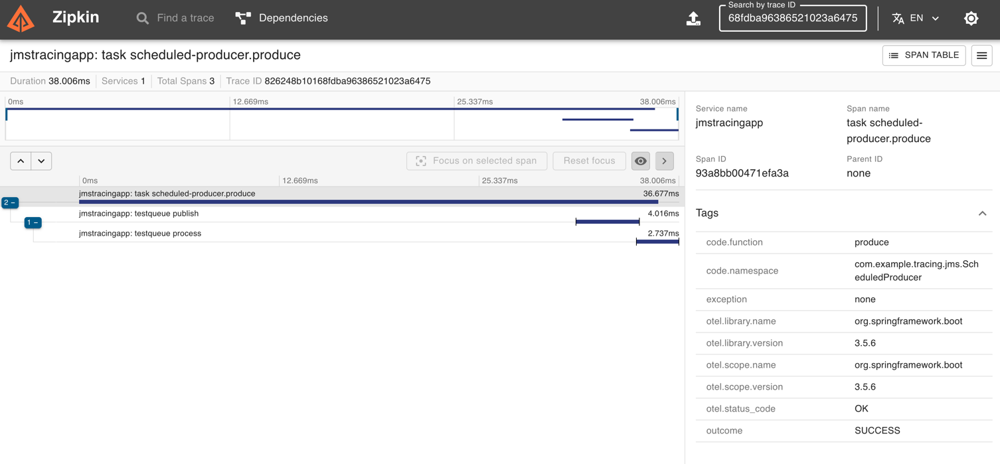

# Spring Boot JMS Tracing

This example demonstrates using [Spring JMS](https://spring.io/guides/gs/messaging-jms) tracing with [Oracle Database Transactional Event Queues](https://docs.oracle.com/en/database/oracle/oracle-database/23/adque/aq-introduction.html).

If you're unfamiliar with Transactional Event Queues, it is a high-throughput, distributed asynchronous messaging system built into Oracle Database. The integration of Transactional Event Queues with Spring JMS provides a simple interface for rapid development of messaging applications.

The [Spring Boot Starter for AQ/JMS](https://github.com/oracle/spring-cloud-oracle/tree/main/database/starters/oracle-spring-boot-starter-aqjms) used in the example pulls in all necessary dependencies to use Spring JMS with Oracle Database Transactional Event Queues, requiring minimal configuration.

## Prerequisites

- Java 21+, Maven
- Docker compatible environment with docker-compose

## Setup Oracle Database Free and Zipkin with docker-compose

Start the Oracle Database Free and Zipkin containers with docker-compose:

```bash
docker-compose -d
```

When the database starts, the [grant_permissions.sql](./oracle/grant_permissions.sql) is run, creating a test user and a JMS queue.

## Run the sample

This command starts the Java application, which will immediately begin producing and consume messages over the JMS queue in Oracle Database:

```bash
mvn spring-boot:run
```

You should see messages from the consumer, containing a trace ID:

```
2025-10-06T13:04:55.173-07:00  INFO 38731 --- [JMSTracingApp] [ampleConsumer-1] [826248b10168fdba96386521023a6475-0e2395ab2a35fe92] com.example.tracing.jms.Consumer         : Received Message: Message: 2025-10-06T20:04:55.138588Z
```

Here, `826248b10168fdba96386521023a6475` is the trace ID. Yours will be different, as trace IDs are randomly generated.

## View traces

1. Navigate to the Zipkin UI, using the container URL `http://localhost:9411/zipkin/`
2. Click "Run Query" to find all traces, or search for a specific trace ID
3. View the trace! You can see the producer scheduling, publishing the event, and consuming the event in a single trace.

