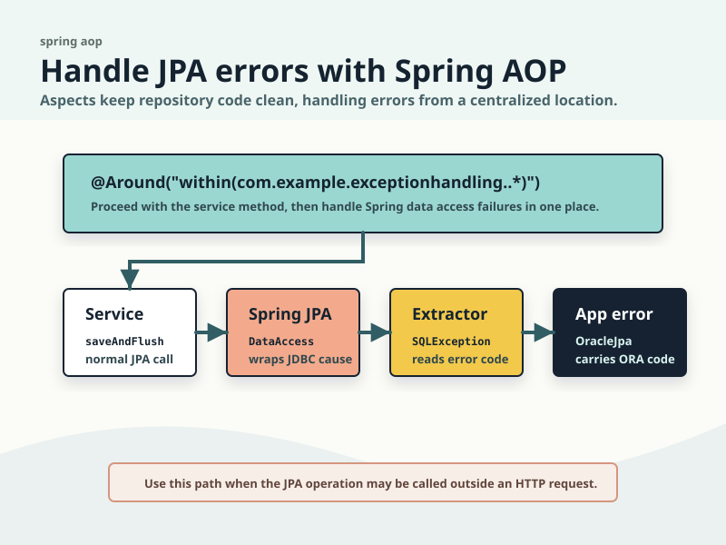
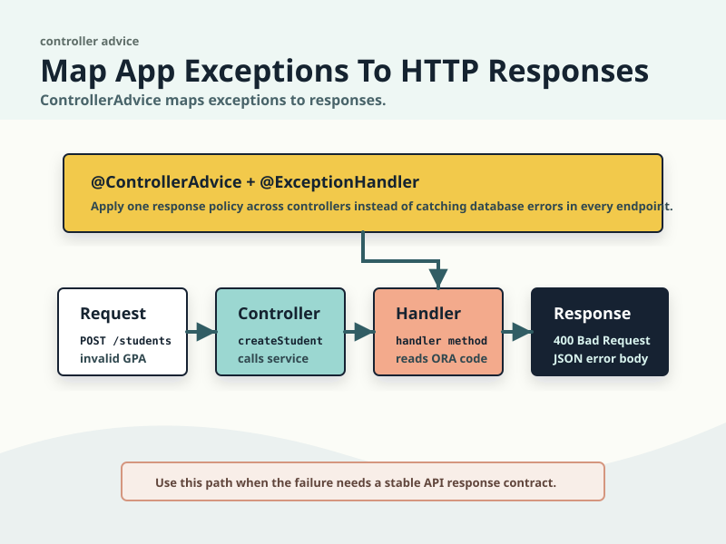

# Handle Spring JPA Errors Close To The Boundary

Database errors get noisy fast in a Spring JPA app.

The repository call fails, Hibernate wraps the JDBC exception, Spring translates it again, and your API can end up returning an unhelpful HTTP 500. The log may have the real `ORA-` code somewhere in the stack trace, but the application has not made a decision about what that code means.

The [`spring-jpa`](https://github.com/anders-swanson/oracle-database-code-samples/blob/main/spring-jpa/README.md) sample keeps the fix deliberately small. It handles Oracle AI Database errors in two places:

- use Spring AOP around service methods when the JPA call is not necessarily part of a web request
- use `@ControllerAdvice` and `@ExceptionHandler` when the failure needs to become an HTTP response

Those two choices solve different problems. AOP translates the database failure into an application exception for non-web callers. Controller advice can translate a Spring data access failure directly into a response contract for web callers. In this sample they are deliberately separate paths.

## Start With The Error You Actually Need

The test schema has a plain check constraint on `student.gpa`:

```sql
gpa number(3,2) check (gpa between 0.00 and 4.00)
```

The test inserts a student with a GPA of `4.50`, which Oracle AI Database rejects with `ORA-02290`. That gives the sample a real database error to handle instead of a mocked exception path.

The shared helper is [`OracleErrorExtractor`](https://github.com/anders-swanson/oracle-database-code-samples/blob/main/spring-jpa/src/main/java/com/example/errors/OracleErrorExtractor.java). It walks through wrapper exceptions until it finds a `SQLException`, then uses `SQLException#getErrorCode()` to build a small [`OracleDatabaseError`](https://github.com/anders-swanson/oracle-database-code-samples/blob/main/spring-jpa/src/main/java/com/example/errors/OracleDatabaseError.java):

```java
return findSQLException(throwable, seen)
        .filter(sqlException -> sqlException.getErrorCode() > 0)
        .map(sqlException -> OracleDatabaseError.fromErrorCode(
                sqlException.getErrorCode(),
                sqlException.getMessage()
        ));
```

That is the first important decision. Match on the numeric database error code, not by parsing localized message text. The message is still useful as detail, but the numeric code is the part you should branch on.

The AOP path wraps the extracted error in [`OracleJpaException`](https://github.com/anders-swanson/oracle-database-code-samples/blob/main/spring-jpa/src/main/java/com/example/errors/OracleJpaException.java), a sample-specific unchecked exception that carries the structured `OracleDatabaseError`.

## Use AOP When The JPA Call Is Not Just An HTTP Concern



The AOP example lives in [`OracleExceptionAspect`](https://github.com/anders-swanson/oracle-database-code-samples/blob/main/spring-jpa/src/main/java/com/example/exceptionhandling/OracleExceptionAspect.java). It wraps the `com.example.exceptionhandling` package:

```java
@Around("within(com.example.exceptionhandling..*)")
public Object translateOracleJpaExceptions(ProceedingJoinPoint joinPoint) throws Throwable {
    try {
        return joinPoint.proceed();
    } catch (DataAccessException exception) {
        throw OracleErrorExtractor.from(exception)
                .map(oracleError -> new OracleJpaException(oracleError, exception))
                .orElseThrow(() -> exception);
    }
}
```

This is a good fit when the same JPA operation may be called by a scheduled job, a message listener, or another service. The database failure is still a domain or application failure, even when there is no HTTP request to answer.

Spring's AOP docs describe `@Around` advice as advice that runs around a matched method execution and calls `proceed()` to run the underlying method. That is exactly what this sample needs: let the service run normally, but translate a Spring `DataAccessException` if Oracle AI Database rejects the operation.

The service code stays boring:

```java
public Student createStudent(Student student) {
    return studentRepository.saveAndFlush(student);
}
```

There is no `try/catch` in [`StudentExceptionHandlingService`](https://github.com/anders-swanson/oracle-database-code-samples/blob/main/spring-jpa/src/main/java/com/example/exceptionhandling/StudentExceptionHandlingService.java). The boundary owns the translation.

That boundary matters. The pointcut in the sample is intentionally narrow. In a real application, I would wrap a package whose methods represent application use cases, not every repository and not every class in the process. A broad aspect can hide failures in places where a local decision would be clearer.

## Use Controller Advice When The Caller Is HTTP



The REST path starts in [`StudentsController`](https://github.com/anders-swanson/oracle-database-code-samples/blob/main/spring-jpa/src/main/java/com/example/web/StudentsController.java). It is intentionally independent from the AOP example. The controller accepts a `POST /students` request and calls the repository directly:

```java
@PostMapping("/students")
@ResponseStatus(HttpStatus.CREATED)
public Student createStudent(@RequestBody Student student) {
    student.setId(null);
    return studentRepository.saveAndFlush(student);
}
```

The controller does not know about `ORA-02290`. It just models the request.

[`StudentExceptionHandler`](https://github.com/anders-swanson/oracle-database-code-samples/blob/main/spring-jpa/src/main/java/com/example/web/StudentExceptionHandler.java) is the HTTP boundary:

```java
@ControllerAdvice
public class StudentExceptionHandler {
    @ExceptionHandler(DataAccessException.class)
    public ResponseEntity<OracleErrorResponse> handleDataAccessException(DataAccessException exception) {
        return OracleErrorExtractor.from(exception)
                .map(this::handleOracleError)
                .orElseGet(() -> ResponseEntity.status(HttpStatus.INTERNAL_SERVER_ERROR)
                        .body(new OracleErrorResponse(
                                "DATA_ACCESS_ERROR",
                                "Oracle AI Database rejected the JPA operation.",
                                exception.getMessage()
                        )));
    }

    private ResponseEntity<OracleErrorResponse> handleOracleError(OracleDatabaseError error) {
        HttpStatus status = error.errorCode() == 2290
                ? HttpStatus.BAD_REQUEST
                : HttpStatus.INTERNAL_SERVER_ERROR;

        OracleErrorResponse response = new OracleErrorResponse(
                error.oraCode(),
                "Oracle AI Database rejected the JPA operation.",
                error.message()
        );
        return ResponseEntity.status(status).body(response);
    }
}
```

Spring MVC's controller advice support lets `@ExceptionHandler` methods apply beyond one controller when they are declared in a `@ControllerAdvice` class. That makes the shape useful for a shared API error contract: choose the status code, choose the response body, and keep those choices out of individual endpoints. In this sample, the handler catches `DataAccessException` and uses the same `OracleErrorExtractor` directly instead of relying on the AOP-created `OracleJpaException`.

In the sample, `ORA-02290` maps to `400 Bad Request` because the client sent a GPA outside the schema's allowed range. Unknown Oracle AI Database errors fall back to `500 Internal Server Error`.

That fallback is not the end state for a production app. It is the honest default for a sample. In a real service, you would add mappings for the database errors your API can explain safely, add logging or metrics, and avoid returning raw database detail if it would expose internal schema information.

## The Test Proves Both Boundaries

The useful part of this sample is that both paths run against Oracle AI Database Free through Testcontainers. [`OracleJpaExceptionHandlingTest`](https://github.com/anders-swanson/oracle-database-code-samples/blob/main/spring-jpa/src/test/java/com/example/OracleJpaExceptionHandlingTest.java) starts `gvenzl/oracle-free:23.26.2-slim-faststart`, initializes `student.sql`, and uses the same invalid student in both tests.

The service-level test checks the AOP translation:

```java
assertThatThrownBy(() -> studentService.createStudent(invalidGpaStudent()))
        .isInstanceOf(OracleJpaException.class)
        .extracting(exception -> ((OracleJpaException) exception).getOracleError())
        .satisfies(error -> {
            assertThat(error.errorCode()).isEqualTo(2290);
            assertThat(error.oraCode()).isEqualTo("ORA-02290");
        });
```

The web-level test checks the controller advice response. This path does not call `StudentExceptionHandlingService`, so it does not rely on the AOP aspect:

```java
mockMvc.perform(post("/students")
                .contentType(MediaType.APPLICATION_JSON)
                .content(new JsonMapper().writeValueAsString(invalidGpaStudent())))
        .andExpect(status().isBadRequest())
        .andExpect(jsonPath("$.code", equalTo("ORA-02290")))
        .andExpect(jsonPath("$.message", equalTo("Oracle AI Database rejected the JPA operation.")))
        .andExpect(jsonPath("$.detail", containsString("ORA-02290")));
```

Run just this proof from the module:

```bash
mvn test -Dtest=OracleJpaExceptionHandlingTest
```

That command does not prove every Oracle AI Database error is mapped correctly. It proves the important plumbing in both directions: the service-level path goes through the aspect and produces `OracleJpaException`, while the REST path skips the aspect, lets Spring raise `DataAccessException`, and lets controller advice extract `ORA-02290` for a stable JSON response.

## Where I Would Draw The Line

Use AOP for exception translation when you want one policy around a set of application operations. It is especially useful when the caller might not be HTTP.

Use `@ControllerAdvice` and `@ExceptionHandler` for HTTP response decisions. That includes status codes, response bodies, and API-level wording.

Avoid making either layer do both jobs. If an aspect starts returning HTTP responses, it is too close to the web layer. If every controller method catches database exceptions by hand, the API is repeating infrastructure code. The sample keeps the split small enough to copy and strict enough to test.

The next practical step is to add one mapping for an Oracle AI Database error your application already sees. Write the Testcontainers test first, trigger the real error, and make the boundary prove the behavior.

## Sources

- [`spring-jpa` sample README](https://github.com/anders-swanson/oracle-database-code-samples/blob/main/spring-jpa/README.md)
- [`OracleExceptionAspect.java`](https://github.com/anders-swanson/oracle-database-code-samples/blob/main/spring-jpa/src/main/java/com/example/exceptionhandling/OracleExceptionAspect.java)
- [`StudentExceptionHandler.java`](https://github.com/anders-swanson/oracle-database-code-samples/blob/main/spring-jpa/src/main/java/com/example/web/StudentExceptionHandler.java)
- [`OracleJpaExceptionHandlingTest.java`](https://github.com/anders-swanson/oracle-database-code-samples/blob/main/spring-jpa/src/test/java/com/example/OracleJpaExceptionHandlingTest.java)
- [Spring Framework: Controller Advice](https://docs.spring.io/spring-framework/reference/web/webmvc/mvc-controller/ann-advice.html)
- [Spring Framework: Around Advice](https://docs.spring.io/spring-framework/reference/core/aop/ataspectj/advice.html#_around_advice)
