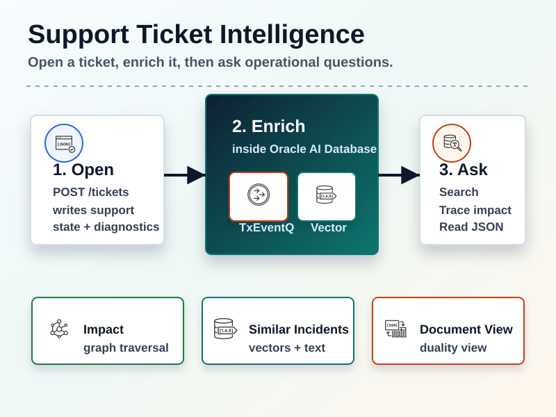
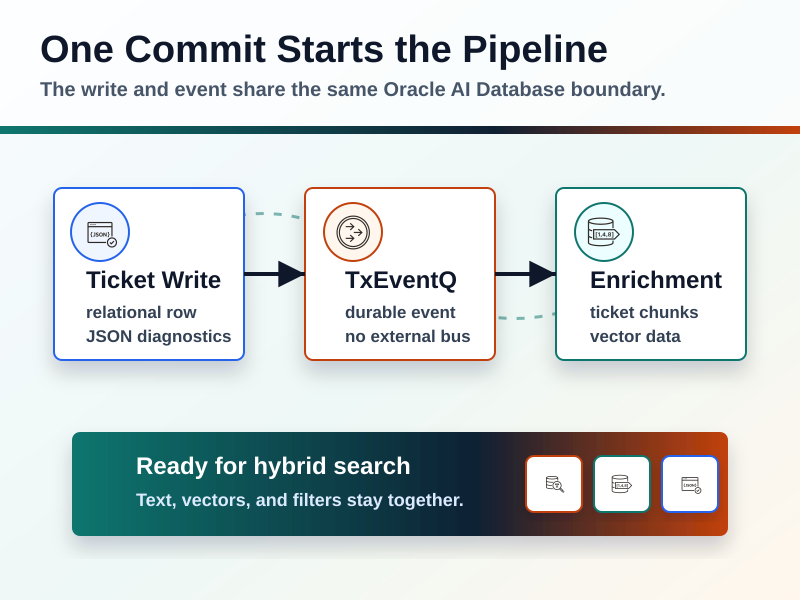
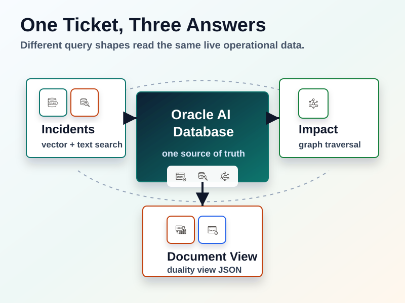
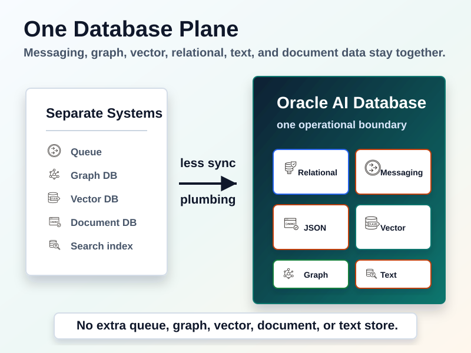

# Support Ticket Intelligence

This sample is a support-ticket workflow app to learn how relational, JSON documents, event-streaming, full-text search, vector search, graph search can work together within a single database engine.

## Database features used

- Relational tables store customers, orders, products, tickets, runbooks, and ticket-to-product relationships.
- JSON columns store flexible product diagnostics and ticket payloads.
- TxEventQ publishes a durable `TicketOpened` event in the same transaction as the ticket insert, then the consumer enriches the ticket asynchronously.
- Oracle Text indexes JSON ticket payloads and product specs so similar-incident search can match error codes, SKUs, subjects, and diagnostic text.
- AI Vector Search queries embeddings for ticket and runbook chunks, ranking incidents with `VECTOR_DISTANCE`.
- SQL property graph models customers, products, tickets, and orders as connected entities so the impact endpoint can traverse affected customers and products.
- JSON Relational Duality Views expose a nested support ticket document over the normalized relational schema.
- Database transactions tie it together: ticket rows, JSON payloads, graph edges, and TxEventQ events are committed or rolled back as one unit.

## Feature map

| Feature | Where it is used | What to look for |
| --- | --- | --- |
| Relational tables | [schema.sql][schema-relational], [TicketEventProducer.java][producer-insert-ticket], [TicketSearchService.java][search-context] | Customers, orders, products, tickets, and runbooks are modeled as normal relational tables, then joined during ticket creation and search. |
| JSON columns | [schema.sql][schema-json], [TicketEventProducer.java][producer-json-payload], [TicketSearchService.java][search-json-values] | Product specs and ticket diagnostics live in JSON columns; ticket creation writes OSON JSON and search extracts JSON values with `json_value`. |
| TxEventQ with OKafka | [OkafkaConfiguration.java][okafka-config], [TicketEventProducer.java][producer-txeventq], [TicketEventConsumer.java][consumer-txeventq] | The producer writes the ticket and publishes `TicketOpened` in one transaction; the consumer polls TxEventQ and enriches the ticket asynchronously. |
| Oracle Text over JSON | [schema.sql][schema-oracle-text], [TicketSearchService.java][search-oracle-text] | JSON search indexes are created over ticket payloads and product specs, then `json_textcontains` filters similar-incident results. |
| AI Vector Search | [schema.sql][schema-vector], [VectorService.java][vector-service], [TicketSearchService.java][search-vector] | Ticket and runbook chunks are embedded with MiniLM, stored in a `VECTOR` column, indexed, and ranked with `VECTOR_DISTANCE`. |
| SQL property graph | [schema.sql][schema-graph], [TicketImpactService.java][impact-graph-table] | A property graph connects customers, tickets, products, and orders; the impact endpoint traverses it with `GRAPH_TABLE`. |
| JSON Relational Duality View | [schema.sql][schema-duality-view], [TicketSearchService.java][search-duality-view], [TicketController.java][controller-document] | `tickets_dv` exposes the normalized ticket, customer, product, and order rows as one nested JSON document. |
| Testcontainers integration test | [SupportTicketIntelligenceTest.java][integration-test] | The test provisions Oracle AI Database Free, initializes schema and seed data, opens a ticket through REST, waits for enrichment, and verifies every query surface. |

The app models a support desk flow:

1. `POST /tickets` creates a support ticket over relational customer, order, and product rows.
2. The ticket payload includes diagnostics as a JSON document.
3. The same transaction publishes a TxEventQ `TicketOpened` event through OKafka.
4. A consumer chunks the ticket and matching runbook text, creates local deterministic MiniLM embeddings, and stores vectors.
5. Query endpoints combine vector search, Oracle Text, JSON filters, relational filters, SQL property graph traversal, and a JSON Relational Duality View.

## The "Converged" Data Platform

Typically, you'd implement this workflow with a separate database and/or service for each feature: a relational database for tickets, a document store for JSON payloads, a message broker for events, a search engine for text, a vector database for embeddings, and a graph database for relationship queries. 

Each component brings its own schema, deployment setup, operational tooling/telemetry, client libraries, data synchronization path, and transactional guarantees. This sample stores everything inside Oracle AI Database, coalescing all the moving parts to a single component.

## Diagrams









## Run the test

From the repository root:

```bash
mvn test -pl support-ticket-intelligence
```

The test starts Oracle AI Database Free with Testcontainers, grants TxEventQ and SQL property graph privileges, initializes the schema and seed data, starts the Spring Boot app, creates a ticket through REST, waits for event-driven enrichment, and verifies:

- the relational ticket row exists
- the TxEventQ consumer created vector chunks
- the hybrid search endpoint returns the expected prior incident
- the impact endpoint returns affected customers and orders through `GRAPH_TABLE`
- the document endpoint reads the same ticket through `tickets_dv`

You should see output similar to the following:
```
[support-ticket-intelligence] ------------------------------------------------------------
[support-ticket-intelligence] Seed Incident Preparation
[support-ticket-intelligence] ------------------------------------------------------------
[support-ticket-intelligence]   Vector chunks: Preparing searchable chunks for seeded incidents
[support-ticket-intelligence]   Seed tickets:  2 ticket(s) need chunks
[support-ticket-intelligence]   Enrich:        ticketId=1001
[support-ticket-intelligence]   Enrich:        ticketId=1002

[support-ticket-intelligence] ------------------------------------------------------------
[support-ticket-intelligence] Ticket Creation
[support-ticket-intelligence] ------------------------------------------------------------
[support-ticket-intelligence]   REST:          Opening a new support ticket
[support-ticket-intelligence]   HTTP:          POST /tickets
[support-ticket-intelligence]   Created:       ticketId=1, status=OPEN

[support-ticket-intelligence] ------------------------------------------------------------
[support-ticket-intelligence] Event Enrichment
[support-ticket-intelligence] ------------------------------------------------------------
[support-ticket-intelligence]   Consumer:      Waiting for TxEventQ enrichment for ticket 1
[support-ticket-intelligence]   Chunks:        ticketId=1, count=2
[support-ticket-intelligence]   Vector chunks: Ticket 1 is searchable

[support-ticket-intelligence] ------------------------------------------------------------
[support-ticket-intelligence] Hybrid Search
[support-ticket-intelligence] ------------------------------------------------------------
[support-ticket-intelligence]   Search:        Relational filters + JSON text + vector similarity
[support-ticket-intelligence]   HTTP:          GET /tickets/1/similar?customerTier=ENTERPRISE&slaStatus=OPEN
[support-ticket-intelligence]   Result:        1 similar incident candidate(s)

[support-ticket-intelligence] ------------------------------------------------------------
[support-ticket-intelligence] Graph Impact
[support-ticket-intelligence] ------------------------------------------------------------
[support-ticket-intelligence]   Graph:         Querying affected customers and products
[support-ticket-intelligence]   HTTP:          GET /tickets/1/impact
[support-ticket-intelligence]   Result:        2 impact path(s)

[support-ticket-intelligence] ------------------------------------------------------------
[support-ticket-intelligence] Document View
[support-ticket-intelligence] ------------------------------------------------------------
[support-ticket-intelligence]   Document:      Reading the ticket from the JSON-relational duality view
[support-ticket-intelligence]   HTTP:          GET /tickets/1/document
[support-ticket-intelligence]   Complete:      Support ticket intelligence flow verified
```

## API

Create a ticket:

```bash
curl -X POST "http://localhost:8080/tickets" \
  -H "Content-Type: application/json" \
  -d '{
    "customerId": 1,
    "orderId": 500,
    "productId": 100,
    "subject": "Checkout terminals cannot reach inventory router",
    "body": "Acme checkout terminals report ORA12541 when order service traffic crosses CXROUTER9K.",
    "errorCode": "ORA12541",
    "severity": "HIGH",
    "slaStatus": "OPEN"
  }'
```

Find similar incidents:

```bash
curl "http://localhost:8080/tickets/1/similar?customerTier=ENTERPRISE&slaStatus=OPEN"
```

Show affected customers and orders:

```bash
curl "http://localhost:8080/tickets/1/impact"
```

Read the ticket as a document:

```bash
curl "http://localhost:8080/tickets/1/document"
```

## Files to inspect

- [schema.sql](https://github.com/anders-swanson/oracle-database-code-samples/blob/main/support-ticket-intelligence/src/test/resources/schema.sql)
- [TicketEventProducer.java](https://github.com/anders-swanson/oracle-database-code-samples/blob/main/support-ticket-intelligence/src/main/java/com/example/support/messaging/TicketEventProducer.java)
- [TicketSearchService.java](https://github.com/anders-swanson/oracle-database-code-samples/blob/main/support-ticket-intelligence/src/main/java/com/example/support/TicketSearchService.java)
- [SupportTicketIntelligenceTest.java](https://github.com/anders-swanson/oracle-database-code-samples/blob/main/support-ticket-intelligence/src/test/java/com/example/support/SupportTicketIntelligenceTest.java)

[schema-relational]: https://github.com/anders-swanson/oracle-database-code-samples/blob/main/support-ticket-intelligence/src/test/resources/schema.sql#L9-L54
[producer-insert-ticket]: https://github.com/anders-swanson/oracle-database-code-samples/blob/main/support-ticket-intelligence/src/main/java/com/example/support/messaging/TicketEventProducer.java#L23-L37
[search-context]: https://github.com/anders-swanson/oracle-database-code-samples/blob/main/support-ticket-intelligence/src/main/java/com/example/support/TicketSearchService.java#L23-L35
[schema-json]: https://github.com/anders-swanson/oracle-database-code-samples/blob/main/support-ticket-intelligence/src/test/resources/schema.sql#L17-L44
[producer-json-payload]: https://github.com/anders-swanson/oracle-database-code-samples/blob/main/support-ticket-intelligence/src/main/java/com/example/support/messaging/TicketEventProducer.java#L87-L143
[search-json-values]: https://github.com/anders-swanson/oracle-database-code-samples/blob/main/support-ticket-intelligence/src/main/java/com/example/support/TicketSearchService.java#L23-L35
[okafka-config]: https://github.com/anders-swanson/oracle-database-code-samples/blob/main/support-ticket-intelligence/src/main/java/com/example/support/messaging/OkafkaConfiguration.java
[producer-txeventq]: https://github.com/anders-swanson/oracle-database-code-samples/blob/main/support-ticket-intelligence/src/main/java/com/example/support/messaging/TicketEventProducer.java#L52-L84
[consumer-txeventq]: https://github.com/anders-swanson/oracle-database-code-samples/blob/main/support-ticket-intelligence/src/main/java/com/example/support/messaging/TicketEventConsumer.java#L35-L60
[schema-oracle-text]: https://github.com/anders-swanson/oracle-database-code-samples/blob/main/support-ticket-intelligence/src/test/resources/schema.sql#L86-L96
[search-oracle-text]: https://github.com/anders-swanson/oracle-database-code-samples/blob/main/support-ticket-intelligence/src/main/java/com/example/support/TicketSearchService.java#L51-L93
[schema-vector]: https://github.com/anders-swanson/oracle-database-code-samples/blob/main/support-ticket-intelligence/src/test/resources/schema.sql#L56-L104
[vector-service]: https://github.com/anders-swanson/oracle-database-code-samples/blob/main/support-ticket-intelligence/src/main/java/com/example/support/VectorService.java
[search-vector]: https://github.com/anders-swanson/oracle-database-code-samples/blob/main/support-ticket-intelligence/src/main/java/com/example/support/TicketSearchService.java#L38-L42
[schema-graph]: https://github.com/anders-swanson/oracle-database-code-samples/blob/main/support-ticket-intelligence/src/test/resources/schema.sql#L106-L135
[impact-graph-table]: https://github.com/anders-swanson/oracle-database-code-samples/blob/main/support-ticket-intelligence/src/main/java/com/example/support/TicketImpactService.java#L11-L33
[schema-duality-view]: https://github.com/anders-swanson/oracle-database-code-samples/blob/main/support-ticket-intelligence/src/test/resources/schema.sql#L137-L163
[search-duality-view]: https://github.com/anders-swanson/oracle-database-code-samples/blob/main/support-ticket-intelligence/src/main/java/com/example/support/TicketSearchService.java#L94-L168
[controller-document]: https://github.com/anders-swanson/oracle-database-code-samples/blob/main/support-ticket-intelligence/src/main/java/com/example/support/TicketController.java#L52-L55
[integration-test]: https://github.com/anders-swanson/oracle-database-code-samples/blob/main/support-ticket-intelligence/src/test/java/com/example/support/SupportTicketIntelligenceTest.java
