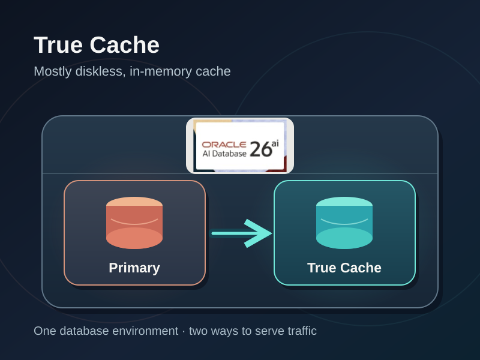
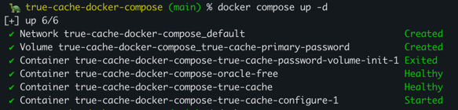

# Oracle AI Database True Cache Docker Compose

This sample runs an Oracle AI Database Free primary and a True Cache instance
for local development. It contains Docker Compose configuration and test scripts.

### Background

True Cache is a mostly-diskless, in-memory, read-only cache integrated into Oracle AI Database. True Cache is configured to replicate data from a primary database. 

Note that True Cache *is* Oracle AI Database, and is not a separate database/caching platform.



For more information how True Cache works for database read paths, see
[True Cache: in-memory reads for Oracle AI Database](https://andersswanson.dev/2026/09/09/true-cache-in-memory-reads-for-oracle-ai-database/).

For Java integration tests, Spring Cloud Oracle provides
[`TrueCacheContainer` Testcontainers support](https://oracle.github.io/spring-cloud-oracle/site/docs/database/testcontainers#testing-oracle-true-cache)
for starting a primary and True Cache on a shared Testcontainers network.


### File References

- [Compose configuration](https://github.com/anders-swanson/oracle-database-code-samples/blob/main/true-cache-docker-compose/docker-compose.yml)
- [Primary password-file startup script](https://github.com/anders-swanson/oracle-database-code-samples/blob/main/true-cache-docker-compose/oracle/startup/00-export-primary-password-file.sh)
- [Primary demo schema setup script](https://github.com/anders-swanson/oracle-database-code-samples/blob/main/true-cache-docker-compose/oracle/redis/configure-true-cache.sql)
- [True Cache Redis dispatcher script](https://github.com/anders-swanson/oracle-database-code-samples/blob/main/true-cache-docker-compose/oracle/redis/configure-redis-dispatcher.sql)
- [Primary-to-cache test script](https://github.com/anders-swanson/oracle-database-code-samples/blob/main/true-cache-docker-compose/test-true-cache.sh)
- [Redis API test script](https://github.com/anders-swanson/oracle-database-code-samples/blob/main/true-cache-docker-compose/test-redis-cli.sh)

### Prerequisites

- Docker and Docker Compose.
- Access to the Oracle AI Database Free image in Oracle Container Registry.
- **Optional**: `redis-cli` to run the separate Redis API test.

Log in to Oracle Container Registry if needed to pull Oracle AI DAtabase Free images:

```bash
docker login container-registry.oracle.com
```

## Start the environment: Oracle AI Database + True Cache

Set an administrator password for local evaluation. The Compose file defaults
to `Welcome12345`:

```bash
export ORACLE_PWD='<local-admin-password>'
docker compose up -d
```



Wait for `oracle-free` and `true-cache` to become healthy and for
`true-cache-configure` to exit successfully. That one-shot service registers
`FREEPDB1_TC` on the primary, creates the `TRUE_CACHE_DEMO` user and demo schema
objects there, then configures a TCPS endpoint and Redis dispatcher on True
Cache. Check progress with:

```bash
docker compose logs true-cache-configure
```

The demo user is created in `FREEPDB1` with `ORACLE_PWD` as its password.

The database endpoints are:

- Primary: `localhost:1522/FREEPDB1`
- True Cache: `localhost:1523/FREEPDB1_TC`
- True Cache Redis API: `127.0.0.1:6379` (TLS)

Connect read-only clients to the cache using:

```text
jdbc:oracle:thin:@//localhost:1523/FREEPDB1_TC
```

## Exercise primary-to-cache replication

Once `true-cache` is healthy and `true-cache-configure` has completed, run the
included script:

```bash
./test-true-cache.sh
```

The script adds two coffee lots to the primary's inventory: 25 bags of
Ethiopian Yirgacheffe and 18 bags of Colombian Huila. It waits until True Cache
shows both stock counts, sells three bags of the Ethiopian coffee on the
primary, then waits until True Cache shows 22 bags for that lot while the
Colombian lot remains at 18. Each read phase retries for about one minute. The
lots remain available for inspection, and the script prints their two numeric
lot IDs as its final output.
It does not require `redis-cli`.

## Verify the Redis API

Run the separate Redis test:

```bash
./test-redis-cli.sh
```

It checks for `redis-cli` before doing any database work, runs the SQL insert,
read, update, read test with two new inventory lots, then authenticates over
TLS and uses `HGET` to check both final stock counts through True Cache. It
prints the Redis results as a table and exits with an error if the counts do
not match.

### Run `redis-cli` directly

`configure-true-cache.sql` creates `TRUE_CACHE_DEMO.COFFEE_INVENTORY` on the
primary:

| Column | Type | Purpose |
| --- | --- | --- |
| `lot_id` | `NUMBER` | Automatically generated primary key for a coffee lot |
| `coffee_name` | `VARCHAR2(100)` | Coffee variety |
| `bags_in_stock` | `NUMBER(6)` | Available bags, never negative |
| `roasted_on` | `DATE` | Roast date, defaulting to today |

Each invocation creates two new lots, so the example can be run repeatedly.
Identity values can skip numbers. Create the lots and capture their IDs:

```bash
read -r ethiopian_lot_id colombian_lot_id < <(./test-true-cache.sh)
```

Read the Ethiopian lot's `bags_in_stock` column with `HGET`:

```bash
REDISCLI_AUTH="$ORACLE_PWD" redis-cli --tls --insecure \
  -h 127.0.0.1 -p 6379 --user TRUE_CACHE_DEMO \
  HGET "true_cache_demo.coffee_inventory:lot_id=$ethiopian_lot_id" bags_in_stock
```

The script inserts the lots on the primary, then reduces the Ethiopian lot's
stock from 25 to 22. It does not create separate Redis keys. Oracle Redis
Server interprets the key string as a SQL row lookup: `schema.table` names the
table, and `lot_id=$ethiopian_lot_id` identifies the row. The final
`bags_in_stock` argument asks `HGET` for that row's `BAGS_IN_STOCK` column. The
result should be `22`.
`REDISCLI_AUTH` supplies the demo user's password from `ORACLE_PWD`; `--insecure`
accepts this example's self-signed local certificate.

## Stop the environment

```bash
docker compose down
```

The databases use container-local storage and are removed with their containers.
Only the shared primary password file uses a named volume. An older version of
this example used database data volumes; Compose does not delete those existing
volumes automatically.

## Detailed Redis API Configuration

The `true-cache-configure` service creates a local self-signed TCPS certificate
and adds a `PRE=REDIS` dispatcher for the `FREEPDB1` PDB service on port `6379`.
The host port is bound to loopback. The helper also sets `SHARED_SERVERS=1`,
which is required for the dispatcher to accept Redis connections. The SQL
client still uses the `FREEPDB1_TC` True Cache service. Oracle True Cache
authenticates Redis connections as a database user and looks up rows with SQL
keys. It does not provide a general Redis key-value store. Commands such as
`HGET` and `GET` read database rows, while Redis write commands do not update the
database. See Oracle's
[True Cache Redis Server guide](https://docs.oracle.com/en/database/oracle/oracle-database/26/odbtc/using-oracle-true-cache-redis-server.html)
for supported commands and key syntax.

The helper runs read-only bind-mounted SQL*Plus scripts after True Cache starts:
[primary demo schema setup](https://github.com/anders-swanson/oracle-database-code-samples/blob/main/true-cache-docker-compose/oracle/redis/configure-true-cache.sql)
and [cache Redis dispatcher setup](https://github.com/anders-swanson/oracle-database-code-samples/blob/main/true-cache-docker-compose/oracle/redis/configure-redis-dispatcher.sql).

Oracle Redis Server also works on an Oracle Active Data Guard standby, where it
serves read-only standby data while redo apply runs. This is supported starting
with Oracle AI Database 26ai Release Update 23.26.3; see Oracle's
[Active Data Guard Redis Server documentation](https://docs.oracle.com/en/database/oracle/oracle-database/26/sbydb/managing-oracle-data-guard-physical-standby-databases.html).

The Redis test script uses `redis-cli --tls --insecure` because the local endpoint
uses the self-signed certificate. Do not use `--insecure` for a remotely
exposed endpoint.
