# True Cache with Docker Compose and redis-cli

This article demonstrates how to run Oracle True Cache locally with
`docker-compose` for testing, local development, and experimentation. We'll also
[enable the True Cache Redis API](https://docs.oracle.com/en/database/oracle/oracle-database/26/odbtc/using-oracle-true-cache-redis-server.html)
and verify it with `redis-cli`.

In the compose script, one container serves as the primary database, while the
second is the True Cache read-only replica. Both the primary and True Cache
databases use the
[`container-registry.oracle.com/database/free:latest`](https://andersswanson.dev/2025/05/22/oracle-database-for-free/)
image.

If you'd like to skip the article and jump to the code sample,
[Start Here](https://github.com/anders-swanson/oracle-database-code-samples/blob/main/true-cache-docker-compose/docker-compose.yml).
If you like the sample, [give the repo a star](https://github.com/anders-swanson/oracle-database-code-samples)!

### Prerequisites

- Docker and Docker Compose.
- **Optional**: `redis-cli` to run the separate Redis API test.

## Background: Oracle True Cache

[Oracle True Cache](https://andersswanson.dev/2026/09/09/true-cache-in-memory-reads-for-oracle-ai-database/)
is a mostly-diskless, in-memory, read-only cache integrated into Oracle AI
Database. True Cache is configured to replicate data from a primary database
through [redo apply](https://docs.oracle.com/en/database/oracle/oracle-database/26/sbydb/oracle-data-guard-redo-apply-services.html).

Note that True Cache *is* Oracle AI Database, and is not a separate
database/caching platform.


*Data from the primary database is replicated to True Cache. Both are Oracle AI
Database.*

## Start the Docker environment

Optionally, set an admin password with the `ORACLE_PWD` environment variable
(defaults to `Welcome12345`), and then run the compose script:

```bash
export ORACLE_PWD='<local-admin-password>'
docker compose up -d
```

You should see the containers start up like so:


Wait for `oracle-free` and `true-cache` containers to become healthy, and for
`true-cache-configure` to exit successfully. That one-shot service registers
`FREEPDB1_TC` on the primary, creates the `TRUE_CACHE_DEMO` user and demo schema
objects there, then configures a TCPS endpoint and Redis dispatcher on True
Cache.

On startup, a demo user is created in the `FREEPDB1` database with
`ORACLE_PWD` as its password. The exposed database ports are:

- Primary: `localhost:1522/FREEPDB1`
- True Cache: `localhost:1523/FREEPDB1_TC`
- True Cache Redis API: `127.0.0.1:6379` (TLS, local certificate)

## Verify True Cache replication



Once `true-cache` is healthy and `true-cache-configure` has completed, run the
[test-true-cache.sh script](https://github.com/anders-swanson/oracle-database-code-samples/blob/main/true-cache-docker-compose/test-true-cache.sh):

```bash
./test-true-cache.sh
```

The script adds two records in the primary database, and waits until True Cache
replicates the data.

The data is then updated in the primary database, and True Cache is read again
to verify the update.

## Verify the Redis API

On container startup, the True Cache Redis API is enabled over port 6379,
served over TLS with a self-signed certificate. This is a read-only,
wire-compatible API for Redis clients to read data from True Cache *as if it
were a Redis server*.



The [test-redis-cli.sh script](https://github.com/anders-swanson/oracle-database-code-samples/blob/main/true-cache-docker-compose/test-redis-cli.sh)
verifies the Redis API against the container setup:

```bash
./test-redis-cli.sh
```

It checks for `redis-cli` before doing any database work, runs the SQL insert,
read, update, read test with two new inventory lots, then authenticates over TLS
and uses `HGET` to check both final stock counts through True Cache. It prints
the Redis results as a table and exits with an error if the counts do not match.

### Run `redis-cli` directly against the database schema

A simple coffee inventory is created on startup, and populated with data by the
test scripts. We can directly connect `redis-cli` to the True Cache endpoint and
query this data.

| Column | Type | Purpose |
| --- | --- | --- |
| `lot_id` | `NUMBER` | Automatically generated primary key for a coffee lot |
| `coffee_name` | `VARCHAR2(100)` | Coffee variety |
| `bags_in_stock` | `NUMBER(6)` | Available bags, never negative |
| `roasted_on` | `DATE` | Roast date, defaulting to today |

Read lot ID 1 with `HGET`:

```bash
REDISCLI_AUTH="$ORACLE_PWD" redis-cli --tls --insecure \
  -h 127.0.0.1 -p 6379 --user TRUE_CACHE_DEMO \
  HGET "true_cache_demo.coffee_inventory:lot_id=1" bags_in_stock
```

Note that the Redis API is read-only. Writes must still be made to the primary
database; writes made with a Redis client will fail.

## Stop the environment

When you're done, tear down the Docker Compose environment:

```bash
docker compose down
```

The databases use container-local storage and are removed with their
containers.

## Optional: Detailed Redis API Configuration

The `true-cache-configure` service creates a local self-signed TCPS certificate
and adds a `PRE=REDIS` dispatcher for the `FREEPDB1` PDB service on port `6379`.
The helper also sets `SHARED_SERVERS=1`, which is required for the dispatcher
to accept Redis connections.

The SQL client still uses the `FREEPDB1_TC` True Cache service. Oracle True
Cache authenticates Redis connections as a database user and looks up rows with
SQL keys. It does not provide a general Redis key-value store. Commands such as
`HGET` and `GET` read database rows, while Redis write commands do not update
the database. See Oracle's
[True Cache Redis Server guide](https://docs.oracle.com/en/database/oracle/oracle-database/26/odbtc/using-oracle-true-cache-redis-server.html)
for supported commands and key syntax.

The helper runs read-only bind-mounted SQL*Plus scripts after True Cache starts:
[primary demo schema setup](https://github.com/anders-swanson/oracle-database-code-samples/blob/main/true-cache-docker-compose/oracle/redis/configure-true-cache.sql)
and
[cache Redis dispatcher setup](https://github.com/anders-swanson/oracle-database-code-samples/blob/main/true-cache-docker-compose/oracle/redis/configure-redis-dispatcher.sql).

Oracle Redis Server also works on an Oracle Active Data Guard standby, where it
serves read-only standby data while redo apply runs. This is supported starting
with Oracle AI Database 26ai Release Update 23.26.3; see Oracle's
[Active Data Guard Redis Server documentation](https://docs.oracle.com/en/database/oracle/oracle-database/26/sbydb/managing-oracle-data-guard-physical-standby-databases.html).

The Redis test script uses `redis-cli --tls --insecure` because the local
endpoint uses the self-signed certificate. Do not use `--insecure` for a remotely
exposed endpoint.

## References

### More about True Cache

- For more information on how True Cache works for database read paths, see [True Cache: in-memory reads for Oracle AI Database](https://andersswanson.dev/2026/09/09/true-cache-in-memory-reads-for-oracle-ai-database/).
- For Java integration tests, Spring Cloud Oracle provides [`TrueCacheContainer` Testcontainers support](https://oracle.github.io/spring-cloud-oracle/site/docs/database/testcontainers#testing-oracle-true-cache) for starting a primary and True Cache on a shared Testcontainers network.

### Files

- [Compose configuration](https://github.com/anders-swanson/oracle-database-code-samples/blob/main/true-cache-docker-compose/docker-compose.yml)
- [Primary password-file startup script](https://github.com/anders-swanson/oracle-database-code-samples/blob/main/true-cache-docker-compose/oracle/startup/00-export-primary-password-file.sh)
- [Primary demo schema setup script](https://github.com/anders-swanson/oracle-database-code-samples/blob/main/true-cache-docker-compose/oracle/redis/configure-true-cache.sql)
- [True Cache Redis dispatcher script](https://github.com/anders-swanson/oracle-database-code-samples/blob/main/true-cache-docker-compose/oracle/redis/configure-redis-dispatcher.sql)
- [Primary-to-cache test script](https://github.com/anders-swanson/oracle-database-code-samples/blob/main/true-cache-docker-compose/test-true-cache.sh)
- [Redis API test script](https://github.com/anders-swanson/oracle-database-code-samples/blob/main/true-cache-docker-compose/test-redis-cli.sh)
