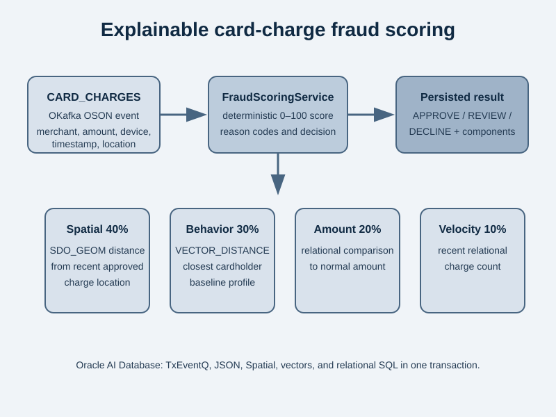

# Credit card fraud detection with OKafka

This sample consumes JSON card-charge events from an OKafka `CARD_CHARGES` topic and persists an explainable fraud assessment in Oracle AI Database. It is deliberately a deterministic teaching example, not a production fraud model.



Each event carries a transaction ID, cardholder, timestamp, amount and currency, merchant/category, channel, device ID, and latitude/longitude. The [FraudScoringService](https://github.com/anders-swanson/oracle-database-code-samples/blob/main/credit-card-fraud-detection/src/main/java/com/example/fraud/FraudScoringService.java) combines four 0–100 signals:

- Spatial: distance from the cardholder's most recent approved charge during the previous two hours.
- Behavior: cosine distance from the closest `VECTOR(8, FLOAT32)` cardholder profile.
- Amount: increase over the cardholder's normal amount.
- Velocity: charge count in the previous fifteen minutes.

The persisted total weights Spatial 40%, behavior 30%, amount 20%, and velocity 10%. Scores below 40 are `APPROVE`; 40–69 are `REVIEW`; 70 or above are `DECLINE`. Each assessment retains component scores and readable reason codes.

## Run the integration test

Prerequisites:

- Java 21
- Maven
- Docker-compatible container runtime

From the repository root:

```shell
mvn -pl credit-card-fraud-detection -am integration-test
```

The test starts Oracle AI Database Free, grants the Testcontainers user the required TxEventQ privileges, creates the `CARD_CHARGES` topic, then creates semantic cardholder behavior profiles, and produces and consumes four OSON events. It verifies a normal charge is approved, a rapid San Francisco-to-New York charge is declined, and an unfamiliar behavior pattern is reviewed.

The OKafka flow is in [FraudDetectionSample](https://github.com/anders-swanson/oracle-database-code-samples/blob/main/credit-card-fraud-detection/src/main/java/com/example/fraud/FraudDetectionSample.java); the schema and deterministic seed profiles are in [schema.sql](https://github.com/anders-swanson/oracle-database-code-samples/blob/main/credit-card-fraud-detection/src/test/resources/schema.sql) and [data.sql](https://github.com/anders-swanson/oracle-database-code-samples/blob/main/credit-card-fraud-detection/src/test/resources/data.sql).
